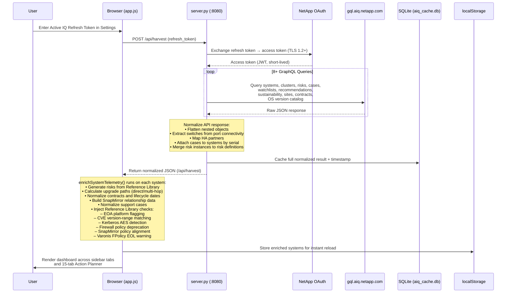

# NetApp Active IQ Advisor Dashboard

[](CHANGELOG.md)
[](LICENSE)
[]()
[]()
[]()

> **Operational intelligence for NetApp Technical Account Managers, Sales Engineers, and Managed Service Providers.**
>
> Harvests your complete fleet telemetry from the Active IQ Digital Advisor GraphQL API, enriches it with a curated Reference Library of CVEs, platform specs, firmware baselines, and operating procedures, then renders it as an interactive dashboard with a 15-tab Action Planner and 6 downloadable deliverables.

---

## Table of Contents

- [Overview](#overview)
- [Architecture](#architecture)
- [Data Flow](#data-flow)
- [Dashboard Tabs](#dashboard-tabs)
- [Action Planner (Tabs 1–15)](#action-planner-tabs-115)
- [Reference Library Enrichment](#reference-library-enrichment)
- [Use Cases](#use-cases)
- [Getting Started](#getting-started)
- [File Structure](#file-structure)
- [Data Security & Compliance](#data-security--compliance)
- [Troubleshooting](#troubleshooting)
- [Change History](#change-history)

---

## Overview

The **Active IQ Advisor Dashboard** is a browser-based operational intelligence platform designed for NetApp Technical Account Managers (TAMs), Sales Engineers (SEs), and Managed Service Providers (MSPs). It provides a single-pane-of-glass view of an entire customer fleet — systems, risks, contracts, security advisories, upgrade paths, and sustainability metrics — all in one place.

### What It Does

| Capability | Description |
|---|---|
| **Fleet Harvesting** | Connects to the Active IQ Digital Advisor GraphQL API and harvests systems, clusters, risks, support cases, recommendations, sustainability scores, sites, and contracts for the TAM's assigned portfolio |
| **Reference Library Enrichment** | Overlays curated security advisories (CVEs), EOA platform flags, firmware baselines, MetroCluster ISL requirements, Kerberos enforcement detection, and SnapMirror policy alignment checks |
| **15-Tab Action Planner** | Generates a structured executive report spanning technical risks, security, upgrades, contracts, sustainability, and operational health |
| **6 Downloadable Deliverables** | Customer Success Plan, QBR Pack, MSP Service Report, Account Handover Brief, Extended Deliverables, CLI Runbook — all generated client-side |
| **Offline Operation** | After initial sync, the dashboard works fully offline from the SQLite cache and browser localStorage |

---

## Architecture

```
┌─────────────────────────────────────────────────────────────────────┐
│                        Browser (Frontend)                           │
│  ┌──────────┐  ┌──────────┐  ┌──────────┐  ┌────────────────────┐  │
│  │ app.js   │  │styles.css│  │ chart.js │  │   localStorage     │  │
│  │ ~13,200  │  │dark-theme│  │ Chart.js │  │ (client-side cache)│  │
│  │ lines    │  │glassmor- │  │ library  │  │                    │  │
│  │          │  │phism     │  │          │  │                    │  │
│  └────┬─────┘  └──────────┘  └──────────┘  └────────────────────┘  │
│       │  fetch('/api/harvest')                                      │
└───────┼─────────────────────────────────────────────────────────────┘
        │
        ▼
┌─────────────────────────────────────────────────────────────────────┐
│                     server.py (Port 8080)                           │
│  ┌──────────────┐  ┌──────────────┐  ┌───────────────────────────┐ │
│  │ OAuth Token  │  │ GraphQL      │  │ SQLite Cache              │ │
│  │ Exchange     │  │ Harvester    │  │ (aiq_cache.db)            │ │
│  │              │  │ 8+ queries   │  │ WAL mode, persistent      │ │
│  └──────┬───────┘  └──────┬───────┘  └───────────────────────────┘ │
│         │                 │                                         │
└─────────┼─────────────────┼─────────────────────────────────────────┘
          │                 │
          ▼                 ▼
┌──────────────────┐  ┌──────────────────────────────────────────────┐
│ NetApp OAuth     │  │ gql.aiq.netapp.com/graphql                  │
│ Token Endpoint   │  │ Systems, Clusters, Risks, Cases, Watchlists,│
│ (TLS 1.2+)      │  │ Recommendations, Sustainability, Sites,     │
│                  │  │ Contracts, OS Version Catalog                │
└──────────────────┘  └──────────────────────────────────────────────┘
```

### Component Summary

| Component | File | Role |
|---|---|---|
| **Backend Server** | `server.py` | Python HTTP server on port 8080. Handles OAuth token exchange, sends 8+ GraphQL queries to harvest fleet data, normalizes the raw API response, caches results in SQLite (`aiq_cache.db`), and serves the frontend files |
| **Frontend Application** | `app.js` | ~13,200 lines of JavaScript. Contains the system normalizer (`enrichSystemTelemetry`), risk engine, upgrade path calculator, 15-tab Action Planner renderer, 6 deliverable generators, chart rendering, and the Reference Library enrichment engine |
| **Development HTML** | `index_src.html` | HTML shell that loads `app.js` and `styles.css` as external files. Used during development — changes to `app.js` take effect on browser refresh |
| **Compiled HTML** | `index.html` | Single-file HTML with all JS/CSS inlined. For offline distribution — must be rebuilt after code changes |
| **Styles** | `styles.css` | Dark-theme CSS with glassmorphism effects, responsive layout, and sidebar animations |
| **Charts** | `chart.js` | Local copy of the Chart.js library for capacity, trend, and distribution visualizations |
| **Database** | `aiq_cache.db` | SQLite persistent cache (WAL mode) storing the full harvest result with sync metadata |

---

## Data Flow

The following diagram traces the complete lifecycle of data from API credentials to rendered dashboard.



### Step-by-Step Walkthrough

| Step | Location | What Happens |
|---|---|---|
| **1. Authentication** | Settings tab | User pastes their Active IQ Refresh Token. This is a long-lived token generated from the Active IQ portal |
| **2. Token Exchange** | `server.py` | The server exchanges the refresh token for a short-lived access token (JWT) via NetApp's OAuth endpoint over TLS 1.2+ |
| **3. GraphQL Harvesting** | `server.py` | 8+ GraphQL queries are sent to `gql.aiq.netapp.com/graphql` to harvest: systems, clusters, risks, support cases, watchlists, TAM recommendations, sustainability scores, sites, contracts, and the OS version catalog |
| **4. Server Normalization** | `server.py` | Raw API responses are flattened (nested objects extracted), switches are parsed from port connectivity data, HA partners are mapped, support cases are attached to systems by serial number, and risk instances are merged to their parent risk definitions |
| **5. SQLite Caching** | `aiq_cache.db` | The full normalized result is persisted to SQLite in WAL mode with a timestamp, duration, and summary counts (systems, clusters, risks, cases). Subsequent page loads serve cached data instantly while a background thread re-syncs |
| **6. Frontend Fetch** | `app.js` | The frontend fetches `/api/harvest` and receives the normalized JSON payload containing all fleet data |
| **7. Enrichment** | `app.js` → `enrichSystemTelemetry()` | Each system is individually enriched: risks are generated, upgrade paths calculated, contracts and lifecycle dates normalized, SnapMirror data built, support cases normalized, and Reference Library checks injected (EOA flagging, CVE matching, Kerberos detection, firewall deprecation, SnapMirror alignment, Varonis EOL) |
| **8. Client Caching** | `localStorage` | Enriched systems are stored in the browser's localStorage for instant reload on subsequent visits without a network round-trip |
| **9. Rendering** | Dashboard UI | The enriched data is rendered across the sidebar tabs, charts, sortable system inventory, and the 15-tab Action Planner |

---

## Dashboard Tabs

The sidebar provides six primary navigation tabs.

### Overview Dashboard

Fleet-wide KPI cards (total systems, clusters, risks, cases), interactive Chart.js visualizations (capacity trends, risk distribution, platform mix), and a sortable/filterable system inventory table with per-system status indicators.

### Technical Audit

Risk register organized by severity (Critical → High → Medium → Low). Includes security advisories with CVE references, NTAP-SA bulletin IDs, CVSS scores, affected version ranges, and specific remediation steps. Links to the NetApp Security Advisory portal.

### Support & Ops

Contract tracking with active/expiring/expired status cards, End-of-Support (EOS) and End-of-Availability (EOA) date timelines, and a filterable view of open, processing, and closed support cases attached to specific systems.

### Value & ROI (CSM)

Storage efficiency metrics (deduplication, compression, compaction), FabricPool tiering ratios, SnapMirror relationship counts (async/sync), capacity projections with chronological trend charts, and data reduction ratios scoped per-customer.

### Action Planner

The 15-section executive report generator — the core deliverable engine. See [Action Planner details](#action-planner-tabs-115) below.

### Settings & Config

API token management, sync interval configuration, custom account groups (group systems by business unit, region, or any criteria), watchlist management, and full import/export of dashboard state.

---

## Action Planner (Tabs 1–15)

The Action Planner generates a structured operational report with 15 specialized sections. Each tab can be independently generated, filtered per-customer, and exported.

| Tab | Name | Content |
|---|---|---|
| **1** | Executive Summary | KPI summary cards, fleet overview text, key findings |
| **2** | Technical Risks | Prioritized risk register with severity, description, affected systems, and remediation plans. Fix-grouped to consolidate duplicate advisories |
| **3** | Security Advisories | CVE-referenced security bulletins with CVSS scores, affected version ranges, fix versions, and specific CLI remediation steps |
| **4** | Support Cases | Active, processing, and closed support cases with priority sorting, case age tracking, and system-level attachment |
| **5** | OS Upgrades | Direct and multi-hop upgrade paths with version-specific notes, pre-upgrade checks, and post-upgrade recommendations. Supports ONTAP, StorageGRID, and SANtricity upgrade chains |
| **6** | Switch Validation | Cluster and MetroCluster switch inventory with model identification, firmware version status, and ISL requirement validation against Reference Library baselines |
| **7** | Logistics & Health | Site logistics (data center locations, city/country), account contacts, and customer satisfaction (CSAT) scores |
| **8** | Guidelines | Change control procedures aligned to ITIL safety tiers: Non-Disruptive, Disruptive but Data-Safe, and Destructive or Irreversible |
| **9** | Deliverables | 6 downloadable report generators (see below) |
| **10** | Contracts & Lifecycle | Contract status summary (active/expiring/expired), lifecycle event table (EOA/EOS milestones sorted by urgency), and contract renewal pipeline with tech refresh status and service tier breakdown |
| **11** | Sustainability & ESG | Fleet-wide Active IQ Sustainability Score (0–100%) with week-over-week trend, historical weekly snapshots, improvement factors, per-system carbon/energy data, and per-customer data reduction ratio |
| **12** | Recommendations | Active IQ key recommendations grouped by category: VERSION, AUTO_SUPPORT, BEST_PRACTICES, CONFIG, and SUPPORT_AND_ENTITLEMENTS — with rank scores and sub-categories |
| **13** | Account Intelligence | Account personnel table (Sales Rep, CSM, SAM, ASP, Propensity per system), site inventory filtered per-customer, and summary cards |
| **14** | Contract Compliance | Compliance posture cards (active/expired contracts, warranty status), service tier distribution breakdown, and per-system renewal pipeline with HW/SW service levels and EOA/EOS dates |
| **15** | Operational Health | AutoSupport (ASUP) health (7-day recency check), Anti-Ransomware Protection (ARP) enablement audit, firmware currency analysis, and last reboot timeline sorted by days since reboot |

### Downloadable Deliverables (Tab 9)

| Deliverable | Description |
|---|---|
| **Customer Success Plan** | Executive-facing document summarizing fleet health, key risks, and strategic recommendations |
| **QBR Pack** | Quarterly Business Review package with KPIs, risk trends, and action items — ready for customer presentation |
| **MSP Service Report** | Monthly managed service report template with SLA metrics, case resolution summary, and risk posture |
| **Account Handover Brief** | Structured briefing document for TAM-to-TAM account transitions, covering all fleet context and open items |
| **Extended Deliverables** | Comprehensive technical deep-dive with full risk register, advisory inventory, and upgrade roadmap |
| **CLI Runbook** | Copy-paste-ready ONTAP CLI commands organized by remediation action, with ITIL safety tier classifications |

---

## Reference Library Enrichment

**New in v3.1.0** — The Reference Library is a curated knowledge base embedded in `app.js` that enriches every system during the `enrichSystemTelemetry()` pass. It is synchronized from the NetApp Reference Library folder and provides intelligence that goes beyond what the Active IQ API alone delivers.

### EOA Platform Flagging

Detects systems running End-of-Availability hardware and flags them for tech refresh planning.

| Family | EOA Models |
|---|---|
| **AFF** | A200, A220, A300, A320, A700, A700s, C190, C800 |
| **ASA** | ASA C250, ASA C400, ASA C800 |
| **FAS** | FAS2600, FAS500f, FAS8200, FAS9000 |

### CVE/Advisory Database

7+ tracked CVEs with version-range matching, CVSS scores, and specific remediation commands.

| CVE ID | Product | Severity | CVSS | Summary |
|---|---|---|---|---|
| CVE-2026-22050 | ONTAP | High | 7.5 | Snapshot Lock Bypass — locked snapshots can be deleted. Fix: 9.16.1P9 / 9.17.1P2+ |
| CVE-2026-22052 | ONTAP | Medium | 5.3 | S3 NAS Bucket information disclosure to limited-access users |
| CVE-2026-20833 | ONTAP CIFS/SMB | Medium | 5.9 | Microsoft Kerberos AES enforcement (KB5073381) — may break CIFS auth |
| CVE-2026-22054 | Config Advisor | Medium | 5.3 | Hard-coded credentials in Config Advisor 6.7.3 |
| CVE-2025-26512 | SnapCenter | Critical | 9.9 | Privilege escalation — low-privilege user gains admin access. Fix: 6.0.1P1 / 6.1P1+ |
| CVE-2026-22051 | StorageGRID | Medium | 4.3 | Authenticated metrics query information disclosure. Fix: 11.9.0.13 / 12.0.0.6+ |
| CVE-2026-24051 | Trident | High | 7.0 | OpenTelemetry PATH hijacking → local privilege escalation. Fix: v26.02.0+ |

### ONTAP Version Highlights

Per-version feature summaries used to justify upgrade recommendations to customers.

| Version | Key Highlights |
|---|---|
| **9.19.1** | Current GA. SnapMirror active sync transparent failover for AIX; tamperproof snapshot locking for SM Sync; direct-attach FC; active-active multipathing on AFF |
| **9.18.1** | SnapMirror cloud for MC FlexGroup; new controller replace combos in MC-IP; 100Gbps ISL minimum |
| **9.17.1** | MC-IP E2E encryption extended to next-gen platforms; AFX platform requires 9.17.1+ |
| **9.16.1** | IPsec HW offload; ARP/AI (99% precision, no learning on FlexVol); NVMe/TCP over TLS 1.3; OAuth 2.0 Entra ID; WebAuthn MFA |
| **9.14.1** | CLI consistency groups; NVMe/TCP auto-discovery; TSSE physical-used semantics change; OAuth 2.0 ADFS |
| **9.12.1** | SM Sync 300TB FlexVol; System Manager NetApp Console integration; tamper-proof logging default |
| **9.10.1** | ARP introduced; firewall policies deprecated → LIF service policies (**breaking**); SnapLock coexistence |

### MetroCluster ISL Requirements

Distance limits, packet loss/jitter thresholds, and MTU requirements from the Reference Library.

| Parameter | FC (Brocade) | FC (Other) | IP |
|---|---|---|---|
| **Max Distance** | 300 km | 200 km | 700 km |
| **Max Packet Loss** | 0.01% | 0.01% | 0.01% |
| **Max Jitter** | 3 ms | 3 ms | 3 ms |
| **Fabric Asymmetry** | 0.2 ms | 0.2 ms | 0.2 ms |
| **Required MTU** | — | — | 9216 bytes |

### Firmware Baselines

Recommended minimum firmware versions for shelf modules and switches.

| Component | Recommended Minimum | Label |
|---|---|---|
| NSM100 | 0220 | NSM100 Shelf Module |
| IOM12 | 0260 | IOM12 SAS Module |
| IOM3 | 0200 | IOM3 SAS Module |
| Cisco NX-OS | 9.3(12) | Cisco Nexus Switch |
| Cisco MDS | 9.2(2) | Cisco MDS Switch |
| Brocade FOS | 9.2.1 | Brocade FC Switch |
| Broadcom EFOS | 3.8.0.2 | Broadcom Ethernet Switch |

### Additional Enrichment Checks

| Check | Description |
|---|---|
| **Kerberos AES Enforcement Detection** | Flags all CIFS/SMB-serving systems for Microsoft KB5073381 (Apr–Jul 2026 enforcement). Validates that AES encryption is enabled for Kerberos and RC4/DES is disabled |
| **SnapMirror Synchronous Policy Alignment** | Detects `strict-sync-mirror` vs `sync-mirror` policy mismatches and flags systems that may experience different RPO behavior during failover |
| **Varonis FPolicy EOL Warning** | Alerts on Varonis FPolicy connector end-of-life deadline (December 31, 2026) for systems with Varonis integration |
| **Legacy Firewall Policy Detection** | Identifies systems on ONTAP 9.10.1+ still using deprecated `firewall-policy` configurations instead of LIF service policies |
| **SnapCenter Version Chain** | Tracks SnapCenter versions from 4.5 through 6.2.1 for upgrade path calculation |

---

## Use Cases

### 1. Quarterly Business Review Preparation

Generate a complete QBR pack for any customer in under 30 seconds. Select the customer from the filter dropdown, navigate to Action Planner → Tab 9 (Deliverables), and click **Generate QBR Pack**. The output includes KPI summaries, risk trends, resolved cases, and recommended actions — formatted for executive presentation.

### 2. Security Posture Assessment

Use the Technical Audit tab to instantly identify all CVE-affected systems across your entire fleet. The Reference Library cross-references each system's ONTAP version against 7+ tracked CVEs with version-range matching, showing exactly which advisories apply, their CVSS scores, and the specific upgrade or CLI command required to remediate.

### 3. Upgrade Planning

Tab 5 (OS Upgrades) calculates hop-by-hop upgrade paths for every system. For systems on older ONTAP releases (e.g., 9.8), it maps the required intermediate versions, pre-upgrade checks, and version-specific considerations. Supports ONTAP, StorageGRID, and SANtricity upgrade chains with direct links to NetApp upgrade documentation.

### 4. Contract Renewal Pipeline

Tab 10 (Contracts & Lifecycle) and Tab 14 (Contract Compliance) surface all expiring contracts across the portfolio. Filter by "expiring within 90 days" to build a renewal pipeline, complete with service tier breakdowns, hardware EOA/EOS milestones, and tech refresh status — ready to hand off to sales.

### 5. New Account Onboarding

When assigned a new account, run a single sync to instantly populate the dashboard with the complete fleet inventory — every system, cluster, risk, contract, and support case. Tab 13 (Account Intelligence) provides the personnel map (Sales Rep, CSM, SAM, ASP) and site inventory. Generate an Account Handover Brief from Tab 9 for documentation.

### 6. MetroCluster Health Review

Tab 6 (Switch Validation) inventories all cluster and MetroCluster switches with firmware versions. The Reference Library injects ISL requirement checks (distance, packet loss, jitter, MTU) and validates switch firmware against recommended baselines. Tab 2 (Technical Risks) surfaces any MetroCluster-specific risks from Active IQ.

### 7. MSP Monthly Service Reporting

Managed Service Providers generate monthly customer reports from Tab 9 (Deliverables → MSP Service Report). The report includes SLA performance, case resolution metrics, risk posture trends, and proactive maintenance actions taken. Deliverables are generated entirely client-side — no customer data leaves the local machine.

### 8. EOA/EOS Tech Refresh Planning

The Reference Library automatically flags all End-of-Availability hardware in the fleet (AFF A200/A220/A300/A320/A700/A700s/C190/C800, ASA C250/C400/C800, FAS2600/FAS500f/FAS8200/FAS9000). Combined with Tab 10's lifecycle milestones and Tab 14's warranty status, TAMs can build a prioritized tech refresh plan with clear timelines.

---

## Getting Started

### Prerequisites

| Requirement | Minimum Version | How to Check |
|---|---|---|
| **Python** | 3.8+ | `python --version` |
| **pip** | Any | `pip --version` |
| **Active IQ API Token** | — | [Generate from Active IQ portal](#step-2-get-your-api-token) |

> [!NOTE]
> The server uses only Python standard library modules (`http.server`, `urllib`, `json`, `sqlite3`, `threading`). No additional pip packages are required for the web dashboard. The `requirements_desktop.txt` file is only needed if building the standalone desktop app (requires `pywebview` and `pyinstaller`).

### Step 1: Clone or Download

```bash
git clone https://github.com/ebeauzec/AIQscraper.git
cd AIQscraper
```

### Step 2: Get Your API Token

1. Log in to [activeiq.netapp.com](https://activeiq.netapp.com/)
2. Click **Quick Links** → **API Services**
3. Click **Generate Token** to create your **Refresh Token**
4. Copy the refresh token — you will paste it into the dashboard's Settings tab

> [!IMPORTANT]
> The Refresh Token is a long-lived credential scoped to your Active IQ account. It is stored locally in `aiq_config.json` and never transmitted anywhere except the official NetApp OAuth endpoint.

### Step 3: Start the Dashboard

| Method | Command | Best For |
|---|---|---|
| **Batch File** ⭐ | Double-click `start_dashboard.bat` | **Recommended.** Auto-kills old server processes, starts the server, and opens your browser |
| **PowerShell** | `.\Start-Dashboard.ps1` | Same as batch but with colored status output and Python version check |
| **Direct Python** | `python server.py` then navigate to `http://localhost:8080` | Development — verbose console output for debugging |
| **Desktop App** | `python launcher.py` | Standalone window (requires `pip install pywebview`) |

### Step 4: First Sync

1. Open the dashboard in your browser (`http://localhost:8080`)
2. Navigate to **Settings & Config** (last sidebar tab)
3. Paste your Active IQ **Refresh Token** into the token field
4. Click **Sync** to trigger the initial harvest

The first sync sends 8+ GraphQL queries to the Active IQ API and may take 30–90 seconds depending on portfolio size. Subsequent page loads serve cached data instantly from SQLite while a background thread re-syncs.

### Step 5: Using Groups and Watchlists

- **Custom Groups**: In Settings, create groups to organize systems by business unit, region, or any criteria. Groups persist across sessions
- **Watchlists**: Import Active IQ watchlist IDs to scope the harvest to specific system sets
- **Customer Filter**: Use the sidebar customer dropdown to filter all views and Action Planner tabs to a single customer

### How to Stop

Press **Ctrl+C** in the terminal window, or close the terminal. The batch file and PowerShell launcher automatically kill any existing server processes on port 8080 before starting.

---

## File Structure

| File | Size | Purpose |
|---|---|---|
| `server.py` | ~55 KB | Python backend — OAuth exchange, GraphQL harvesting, SQLite caching, static file serving, `/api/*` proxy |
| `app.js` | ~668 KB | All frontend JavaScript (~13,200 lines) — enrichment engine, risk engine, upgrade calculator, Action Planner, deliverable generators, chart rendering, Reference Library |
| `index_src.html` | ~70 KB | Development HTML shell — loads external `app.js` + `styles.css` |
| `index.html` | ~676 KB | Compiled single-file HTML — all JS/CSS inlined for offline distribution |
| `styles.css` | ~22 KB | Dark-theme CSS with glassmorphism effects |
| `chart.js` | ~209 KB | Chart.js library (local copy) |
| `aiq_cache.db` | Variable | SQLite persistent cache (WAL mode) |
| `aiq_config.json` | ~2 KB | Server configuration (token, sync settings) |
| `start_dashboard.bat` | ~1 KB | Windows batch launcher — kills old processes, starts server, opens browser |
| `Start-Dashboard.ps1` | ~2 KB | PowerShell launcher — colored output, Python check, same lifecycle |
| `launcher.py` | ~8 KB | Desktop app launcher (`pywebview` wrapper for standalone window) |
| `requirements_desktop.txt` | ~1 KB | pip dependencies for desktop app build only (`pywebview`, `pyinstaller`) |
| `build_windows.bat` | ~3 KB | PyInstaller build script for Windows executable |
| `build_mac.sh` | ~2 KB | PyInstaller build script for macOS executable |
| `CHANGELOG.md` | — | Version release history |
| `LICENSE` | — | MIT License |

> [!TIP]
> **Development workflow**: The server serves `index_src.html` which loads the external `app.js`. Changes to `app.js` take effect immediately on browser refresh (Ctrl+Shift+R). The compiled `index.html` is for distribution only and must be rebuilt after code changes.

---

## Data Security & Compliance

### 100% AI-Free Processing

| Guarantee | Detail |
|---|---|
| **Zero AI/ML Dependencies** | No generative AI, no machine learning models, no LLM services — anywhere in the stack |
| **Deterministic Logic** | All risk calculations, upgrade paths, and enrichment use standard JavaScript algorithms with reproducible outputs |
| **No Telemetry** | The tool does not phone home, collect usage analytics, or transmit any metadata |

### Complete Data Sovereignty

| Guarantee | Detail |
|---|---|
| **Local-Only Storage** | All data resides in browser `localStorage` and the local SQLite database (`aiq_cache.db`). No cloud storage, no external databases |
| **Zero External Transmission** | Network traffic is limited exclusively to official NetApp TLS 1.2+ endpoints (`gql.aiq.netapp.com`, `api.activeiq.netapp.com`). No third-party APIs, CDNs, or analytics services |
| **Offline Capable** | After the initial sync, the dashboard operates fully offline from cached data |

### NetApp Security Policy Alignment

| Guarantee | Detail |
|---|---|
| **Read-Only Telemetry** | The tool only reads telemetry data via the Active IQ API. It never executes commands against production systems |
| **Change Control Enforcement** | All remediation outputs are formatted as ITIL-aligned change tickets and CLI runbooks for human review and approval — never auto-executed |
| **Minimal Footprint** | No installation required (runs from source), no persistent services, no external data shares, no registry modifications |

---

## Troubleshooting

| Problem | Cause | Solution |
|---|---|---|
| **Port 8080 in use** | An old server process is still running | Use `start_dashboard.bat` — it auto-kills old processes. Or manually: `netstat -ano \| findstr :8080` to find the PID, then `taskkill /F /PID <pid>` |
| **Dashboard looks outdated / missing tabs** | Browser is serving the compiled `index.html` instead of `index_src.html` with external `app.js` | Restart with `start_dashboard.bat`. Hard refresh: **Ctrl+Shift+R**. Clear browser cache if needed |
| **Server won't start** | Python not installed or not in PATH | Verify: `python --version` (must be 3.8+). Check port availability: `netstat -ano \| findstr 8080` |
| **No data after sync** | Invalid or expired Refresh Token | Verify your token in the Active IQ portal (Quick Links → API Services). Check the terminal window for API error messages. Re-generate the token if expired |
| **CORS errors in console** | Opening the HTML file directly instead of through the server | Always access via `http://localhost:8080`. The API Base URL in Settings should be `/api` (default) |
| **Tabs 10–15 not visible** | Action Planner not generated | Click **Action Planner** in the sidebar → click **Generate** → tabs appear in wrapped rows above the content area |
| **Sync takes too long** | Large portfolio (500+ systems) or slow network | First sync may take 60–90 seconds. Subsequent loads use cached data. Use `?force=1` to force a full re-harvest if cache is stale |
| **Charts not rendering** | Chart.js not loaded | Verify `chart.js` exists in the project directory. Hard refresh the browser. Check the console (F12) for load errors |
| **Desktop app won't launch** | Missing `pywebview` dependency | Install: `pip install -r requirements_desktop.txt`. The desktop app is optional — the browser dashboard works without it |

---

## Change History

See [CHANGELOG.md](CHANGELOG.md) for the complete version release history.

---

<p align="center">
  <strong>NetApp Active IQ Advisor Dashboard v3.1.0</strong><br>
  Built for TAMs, by TAMs.<br>
  <a href="LICENSE">MIT License</a> · <a href="CHANGELOG.md">Changelog</a>
</p>
