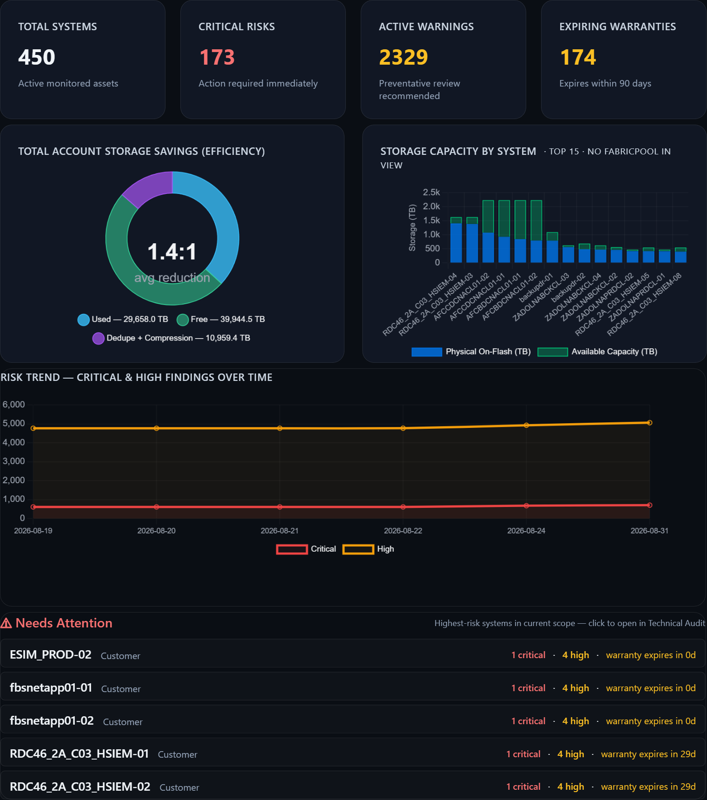
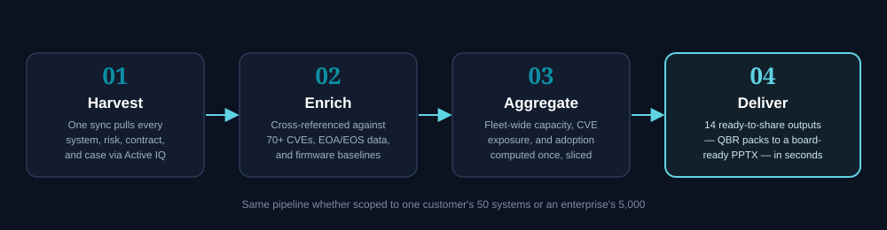
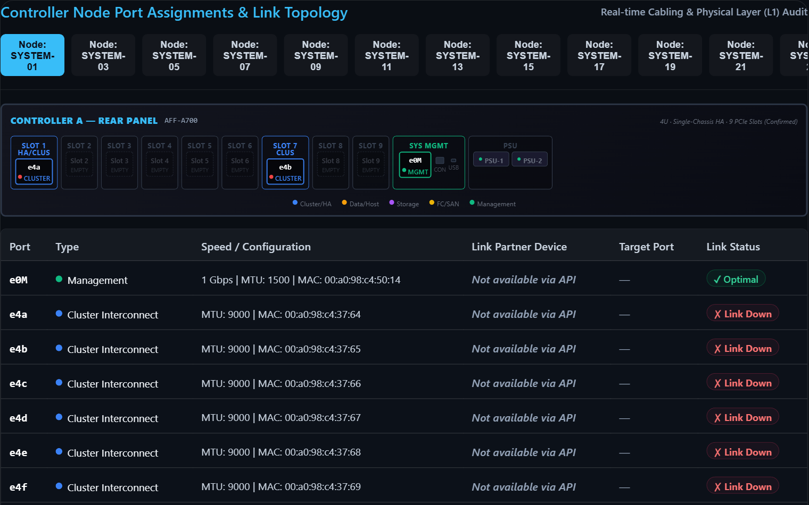
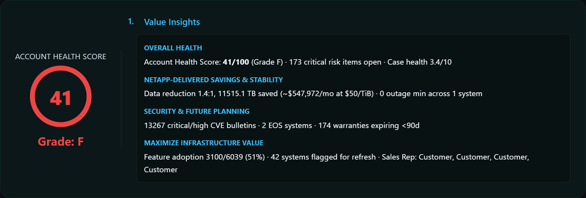
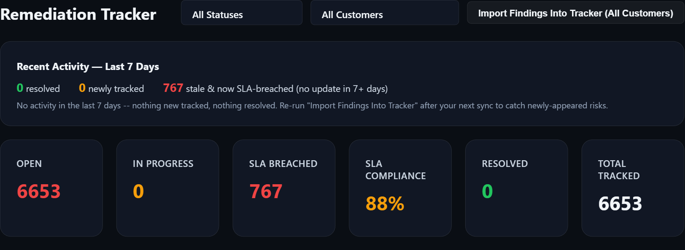
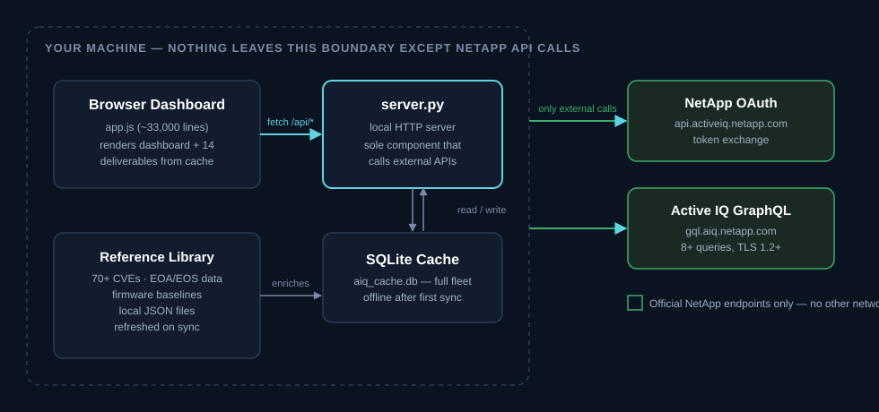

# ARIA — Active IQ Risk Intelligence Advisor

[](CHANGELOG.md)
[](LICENSE)
[]()
[]()
[]()

> **ARIA** (**A**ctive IQ **R**isk **I**ntelligence **A**dvisor) — One tool. Your entire fleet. Customer-ready deliverables. In under two minutes.
>
> Built for NetApp Technical Account Managers, Sales Engineers, and Managed Service Providers who need to walk into every customer meeting fully prepared — with real data, real risks, and ready-to-share reports.
>
> Equally built for **large enterprise end-customers** running NetApp storage at scale — internal storage/infrastructure teams who need a single fleet-wide operational view across hundreds of clusters, business units, or sites, without living inside Active IQ's per-system UI or maintaining a separate spreadsheet of contracts, EOA/EOS dates, and CVE exposure.

<p align="center">
  
</p>
<p align="center"><sub>The Overview Dashboard, live against a real 450-system fleet across two Active IQ accounts. Customer names shown here are redacted for this screenshot only — nothing in the tool itself redacts them.</sub></p>

---

## Table of Contents

1. [Why This Tool — vs. Active IQ Directly](#1-why-this-tool--vs-active-iq-directly)
2. [What It Delivers](#2-what-it-delivers)
3. [Use Cases](#3-use-cases)
4. [Getting Started](#4-getting-started)
5. [Dashboard Guide](#5-dashboard-guide)
6. [Action Planner — All 19 Sections](#6-action-planner--all-19-sections)
7. [Downloadable Deliverables](#7-downloadable-deliverables)
8. [Scores, KPIs & Metrics Reference](#8-scores-kpis--metrics-reference)
9. [Security & Data Privacy](#9-security--data-privacy)
10. [Troubleshooting](#10-troubleshooting)
11. [Internal Architecture](#11-internal-architecture) *(Addendum — for developers)*
12. [Legal & Intellectual Property](#12-legal--intellectual-property)

---

## 1. Why This Tool — vs. Active IQ Directly

Active IQ is excellent for monitoring a single customer. This tool is built for two overlapping audiences where Active IQ's per-customer, per-system UI quickly becomes a bottleneck:

- **TAMs, SEs, and MSPs** who manage **multiple customers and large mixed portfolios** across many separate Active IQ accounts
- **Large enterprise end-customers** who manage their **own** fleet directly — hundreds or thousands of NetApp systems across data centers, business units, or regions, all under one account, where the bottleneck isn't "too many customers" but "too many systems to review one at a time"

Everything below applies to both: a TAM scoping a report to one customer and an enterprise storage architect scoping the same dashboard to one business unit or site are doing the same operation against the same data model.

### What Active IQ gives you

- A web dashboard scoped to one customer at a time
- Risks, advisories, and capacity alerts for systems you navigate to manually
- Case history and contract dates — per system, per customer
- Sustainability scores and recommendations

### What this tool adds on top

| Gap in Active IQ | What the Advisor Dashboard does |
|---|---|
| **One customer at a time** — you must manually switch contexts and re-filter for every account | **Cross-customer fleet view** — all customers, all systems in a single pane. Filter to any customer in one click |
| **No deliverable generation** — you take screenshots or copy/paste into documents | **13 ready-to-share deliverables** — QBR Pack, TAM Success Plan, MSP Report, Handover Brief, CLI Runbook, MEDDPICC Brief, Security Brief, Sustainability Report, Solution Proposals, Implementation Plans, Sales Proposals, Customer Comms, and Change Tickets — generated in seconds, each enriched with fleet-relevant KB references |
| **No upgrade path calculator** — AIQ shows your current version; you have to figure out the hop sequence yourself | **Automatic hop-by-hop upgrade paths** — direct paths where available; multi-hop sequences with intermediate versions and per-version notes for ONTAP, StorageGRID, E-Series (SANtricity), and all live API platforms |
| **CVE matching is generic** — you see advisories but must manually check which of your systems are actually affected | **Per-system CVE cross-referencing** — every system's ONTAP version is tested against **tracked CVEs** (from MITRE, NVD, CISA KEV, NetApp PSIRT, GitHub) with CVSS scores, affected ranges, fix versions, and exact CLI remediation steps. Includes 2 CISA KEV-confirmed actively exploited entries. |
| **Capacity trend is per-system** — no fleet-wide growth rate or cross-customer runway view | **Fleet-wide capacity projection** — 6-month historical trend, growth rate in GB/day, per-node breakdown, and runway estimate per node |
| **Efficiency includes snapshot savings** — the displayed ratio is inflated | **Correct data reduction ratio** — uses dedupe + compression only (no snapshots). Snapshot-inclusive ratio shown separately for reference |
| **No ITIL-aligned change control output** — risks are described but remediation isn't structured for change management | **CLI Runbook with ITIL tiers** — every remediation step classified as Non-Disruptive / Disruptive / Destructive, formatted as change tickets for CAB approval |
| **No Reference Library enrichment** — you must manually cross-reference EOA lists, firmware baselines, and MetroCluster ISL specs | **Automatic enrichment from 268+ live sources** — fleet-aware scanner crawls `docs.netapp.com` indexes and `kb.netapp.com` JSON-LD category trees to discover best practices, upgrade guides, troubleshooting procedures, security hardening docs, configuration guides, and 3rd-party integration references. All 13 deliverables receive fleet-relevant references scored by ONTAP version, platform family, and hardware model. |
| **Version database is static** — you must manually track which ONTAP/StorageGRID/SANtricity versions are current | **Version catalog auto-detection** — scrapes docs.netapp.com during each sync to discover newly released product versions. The upgrade path calculator and latest-version recommendations update automatically without code changes. |
| **No account handover support** — transitioning an account means extensive manual documentation | **Account Handover Brief** — structured briefing generated in one click covering fleet context, open risks, contracts, contacts, and pending actions |
| **No official health score visible per customer** — Active IQ computes one, but a partner-facing view only ever shows an account-wide figure, identical for every customer on that account | **Real per-customer Official Health Score** — `summary(nagpId: ...)` queried once per real customer at harvest time, so the Overview KPI tile, QBR Pack, and Risk & Remediation Brief show each customer's own genuine score (confirmed live: 28 real customers, 28 different scores) alongside this tool's own risk-based score — not the same account-wide number restated for everyone |
| **Recommendation "Score %" is account-wide** — the same percentage shows for every customer under one Active IQ account, with no way to isolate one customer's own figure | **Real per-customer Recommendation scoring** — `recommendations(customerId: ...)` queried once per real customer, so the TAM Recommendations tab, its export, the QBR Pack, and the CSM tab show each customer's own real Score %, not the account-wide figure |
| **No suggested next actions for account planning** — a TAM has to manually decide what a customer's Success Plan should say | **18 auto-suggested Success Plan templates (TAM, SAM, and MSP-focused)** — evaluated against each customer's real risk, security, EOS, contract, capacity, and support-case data; adopting one pre-fills the real Active IQ plan with the actual affected systems, findings, and remediation text behind the trigger — not a generic summary |
| **Data only refreshes when someone is looking** — Active IQ (and most tools built on it) has no independent "keep this current" mechanism of its own | **Independent auto-refresh scheduler** — a real background timer (default every 4 hours) re-syncs the full fleet from Active IQ even with no browser tab open, so the tool reflects current data at all times, not just when last manually synced |
| **ARP and ASUP health require individual system checks** — no fleet-wide audit | **Fleet-wide operational health** — ARP enablement, AutoSupport recency, firmware currency, and reboot timeline across all systems at once |
| **Sustainability requires per-customer navigation** | **Cross-customer ESG dashboard** — fleet sustainability score, carbon/energy data, and data reduction ratios all in one view |
| **Cluster identity gaps** — systems not mapped to a cluster in the API appear unnamed | **Automatic cluster name derivation** — when the API cluster lookup returns empty, the hostname is used with node suffixes stripped (e.g. `A150-CLUSTER-01` → `A150-CLUSTER`) to produce meaningful labels in tables and charts |
| **No visual hardware references** — you must manually check hardware guides for layout | **Platform-specific rear-panel backplate visualization** — renders accurate physical controller rear views for 8+ NetApp hardware families (A70/A90/A1K, A400/A900, A800/C800, A250/C250/FAS2820, E-Series, Cloud, StorageGRID, generic ONTAP) |

### Where this tool is most effective

1. **Portfolio-level preparation** — walking into any QBR or account review with all data ready, not just the one customer you happened to check that morning
2. **Security posture triage** — instantly knowing which systems across all customers are affected by a new CVE, without clicking through each account individually
3. **Contract and renewal pipeline management** — surfacing all expiring contracts across the entire portfolio in one view, ranked by urgency
4. **MSP monthly reporting at scale** — generating per-customer service reports across 20+ customers in minutes rather than hours
5. **Change management readiness** — producing ITIL-formatted CLI runbooks for CAB submission, not just a list of risks
6. **Enterprise fleet-wide governance** — a storage architecture, infrastructure, or platform-engineering team running its own multi-thousand-system NetApp estate can scope the same dashboard by data center, business unit, or environment tag instead of by customer, and get the same cross-fleet CVE, capacity, licensing, and lifecycle visibility a TAM gets across customers
7. **Internal audit and compliance evidence** — the Security Posture Executive Brief, License Compliance report, and Feature Adoption matrix double as ready-made evidence for internal security reviews, license true-ups, and ITAM/CMDB reconciliation at enterprise scale — without a separate BI or reporting layer

> **A note on scale:** every fleet-wide view — capacity projection, CVE cross-reference, ARP/adoption audit, contract pipeline — runs the same aggregation logic whether it's scoped to one customer's 50 systems or an enterprise's 5,000. The dashboard, SQLite cache, and deliverable generators were built and tested against multi-hundred-system portfolios; there is no per-customer ceiling baked into the data model.

<p align="center">
  
</p>

---

## 2. What It Delivers

In a single sync, the tool harvests your complete fleet telemetry from the Active IQ API, enriches it with a curated Reference Library and ARIA Knowledge Base Intelligence engine, and renders it as a fully interactive dashboard with 14 downloadable customer-facing deliverables — each enriched with fleet-relevant KB references, actionable CLI commands, and estimated remediation effort.

**Harvested from Active IQ:**
- Every system and cluster across your entire portfolio
- All open and resolved technical risks and advisories
- Support case history per system
- Contract status, expiry dates, and service tiers
- End-of-Availability and End-of-Support lifecycle milestones
- Sustainability and energy efficiency scores
- Capacity trends and storage efficiency ratios
- AutoSupport status, firmware currency, and Anti-Ransomware Protection (ARP) coverage
- **Drive firmware currency** — per-drive recommended FW comparison with current/behind/unknown status badges
- OS version catalog for upgrade path calculation
- Account personnel (Sales Rep, TAM, SAM, ASP, Propensity)
- **SVM & LIF Inventory** — harvests vserver data (SVM name, type, LIFs with IPs, service policies, failover configuration) from the Active IQ GraphQL API and displays per-node LIF tables in the cabling audit view.
- **Official Active IQ Health Score** — NetApp's own 0–100 score with a 9-factor breakdown (AutoSupport freshness, OS freshness, firmware, security hardening, sustainability, uptime, EOS exposure, add-on adoption, tech refresh), fetched **per real customer** (not one account-wide figure restated for everyone) via `summary(nagpId: ...)`. Distinct from this tool's own risk-based Account Health Score — both are shown, never conflated.
- **Per-aggregate storage detail** — real per-aggregate efficiency ratio, FabricPool tiering status, and dedup/compression-disabled volume counts, harvested for every ONTAP system Active IQ reports aggregate telemetry for. Feeds the Risk & Remediation Brief's Storage Efficiency Opportunities section and the Storage Efficiency & Cost Optimization Success Plan template.
- **Per-customer TAM Recommendation scoring** — Active IQ's `recommendations` Score % fetched once per real customer via `recommendations(customerId: ...)`, so every customer sees their own genuine percentage instead of the account-wide figure.

**Added by the Reference Library (not in Active IQ):**
- **EOA hardware flags** — for a real system in your fleet, EOA/EOS dates come directly from Active IQ's own `systems` query (`hardwareModel.endOfAvailability`/`endOfSupport`) — live, precise, populated for the large majority of a real fleet (confirmed live: 371/484 systems on a real 484-system fleet). This is the primary source and needs no scraping. A separate, manually-maintained platform-name snapshot exists as a fallback only for the minority of systems Active IQ doesn't report a date for (or platforms not yet in your fleet at all) — ⚠️ **that fallback is a frozen snapshot as of September 2026**, since NetApp stopped publishing per-model EOA/EOS dates in a machine-readable form on the page this tool used to scrape it from. The app clearly labels which source a given finding came from, and the fallback carries an explicit staleness caveat; the live per-system finding does not, because it's real.
- **CVE cross-referencing** — advisory entries sourced from MITRE, NVD/NIST, CISA KEV, NetApp PSIRT, GitHub, and threat intelligence feeds. Per-system applicability matched by ONTAP/StorageGRID/SANtricity version range. The database grows continuously as new advisories are published.
- **CISA KEV integration** — CVEs confirmed as actively exploited by CISA are flagged with 🚨 priority. Updated on each Reference Library sync.
- Firmware baseline checks for shelves and switches
- MetroCluster ISL requirement validation
- Kerberos AES enforcement detection
- SnapMirror synchronous policy alignment audit
- Legacy firewall policy deprecation detection
- **Harvest Resilience** — merge-back guard prevents transient API failures from wiping cached system and cluster data.

---

## 3. Use Cases

### QBR / Account Review Preparation

**Goal:** Walk into a quarterly review with complete, accurate, customer-specific data — without spending the morning manually pulling information.

**Workflow:**
1. Select the customer from the sidebar filter dropdown
2. Click **Sync** (or use today's cached data)
3. Go to **Action Planner** → click **Generate**
4. Navigate to **Tab 18 → QBR Pack** → click **Generate QBR Pack**

**Output:** A QBR Pack containing KPI scorecard, risk trend, resolved cases, open action items, and upgrade roadmap — ready for the customer presentation.

---

### Security Posture Assessment

**Goal:** When a new CVE or ONTAP advisory is published, immediately know which systems across all customers are affected — not just the ones you happen to check.

**Workflow:**
1. Go to **Technical Audit** in the sidebar
2. The **Security Advisories** section lists all tracked CVEs with per-system applicability
3. Each entry shows: CVE ID, CVSS score, affected version range, fixed version, and the specific CLI command to remediate
4. Use **Action Planner → Tab 3** to produce a customer-scoped security advisory section

**Output:** A complete, system-level security exposure list across your entire portfolio, with remediation steps ready to go into a CLI Runbook.

---

### Capacity Planning & Runway Review

**Goal:** Know which systems are approaching capacity limits — per node, with actual growth rates, not just a percentage bar.

**Workflow:**
1. Go to **Value & ROI** in the sidebar
2. The capacity chart defaults to **Aggregate** (fleet-wide). Click **Per Node** to see individual node trend lines
3. The **Capacity Breakdown by Node** table shows: Used TB, Raw TB, Utilisation %, Growth/day, and Runway per node
4. Nodes approaching limits are colour-coded amber (>70%) and red (>85%)

**Output:** A per-node capacity breakdown with runway estimates, sourced from actual monthly telemetry data — matching the chart data exactly.

---

### Contract & Renewal Pipeline

**Goal:** Surface all expiring contracts and EOA hardware across the portfolio to build a proactive renewal and tech refresh pipeline.

**Workflow:**
1. Go to **Action Planner → Tab 7** (Contracts & Lifecycle) for the full expiry view
2. Cross-reference with **Tab 8** (Contract Compliance) for hardware warranty and service tier status
3. Filter by customer or by urgency (expiring within 30/60/90 days)
4. Generate an **Account Handover Brief** or **Extended Deliverables** from Tab 18 for formal documentation

**Output:** A ranked contract renewal pipeline with EOA/EOS milestones, tech refresh status, and service tier breakdown.

---

### OS Upgrade Planning

**Goal:** For every system running a non-current ONTAP release, determine the exact upgrade path — including any required intermediate versions.

**Workflow:**
1. Go to **Action Planner → Tab 4** (OS Upgrades)
2. Each system shows its current version and the recommended target
3. Multi-hop paths display all intermediate versions with version-specific notes and pre/post checks
4. Use the **CLI Runbook** deliverable (Tab 18) to extract upgrade commands for change management submission

**Output:** A system-by-system upgrade roadmap with hop sequences, version notes, and ITIL-classified CLI steps.

---

### MSP Monthly Service Reporting

**Goal:** Generate per-customer monthly service reports across a large managed portfolio without manual data compilation.

**Workflow:**
1. Select the customer from the sidebar filter
2. Go to **Action Planner → Tab 18 → MSP Service Report**
3. Click **Generate MSP Service Report**

**Output:** A monthly service report with SLA metrics, case resolution summary, proactive actions taken, and risk posture change — one per customer, all client-side.

---

### Success Plan Management

**Goal:** Give every customer a real, trackable Success Plan in Active IQ Digital Advisor — grounded in that customer's actual data, not a blank template a TAM has to fill in from scratch.

**Workflow:**
1. Select the customer from the sidebar filter (or view "All" to see suggestions across the whole portfolio)
2. Go to **Success Plans** — the **Suggested Success Plans** card lists any of the 18 templates whose real trigger condition is currently met for that customer (e.g. open critical risks, systems without ARP, contracts expiring, capacity runway under 60 days)
3. Click **Preview full plan** on any suggestion to review the exact content before adopting — the full challenges/goals text with affected systems, every remediation objective, and the TAM notes, built from the same function that constructs the real write-back so nothing differs between preview and post
4. Check the ones to adopt and click **Adopt Selected**, then confirm the write-back — each adopted suggestion becomes a real Active IQ Success Plan, pre-filled with the actual affected system names/serials, the real finding text (risk descriptions, CVE IDs, EOS dates, case numbers), and the real Active IQ remediation text for each, not a generic summary
5. The Success Plans table's **Progress** column tracks the real trigger metric from adoption baseline to current value on every view

**Output:** A set of customer-specific, fully-populated Success Plans visible to the whole team in Digital Advisor — created in minutes instead of drafted by hand per customer.

---

### New Account Onboarding / Handover

**Goal:** When assigned a new account, rapidly understand the full fleet context. When handing off, produce a structured briefing.

**Workflow:**
1. Sync the portfolio (all accounts come in together — no per-account setup)
2. Select the customer in the sidebar filter
3. Review **Tab 11** (Account Intelligence) for the personnel map and site inventory
4. Generate an **Account Handover Brief** from **Tab 18**

**Output:** A structured handover document covering fleet health, open risks, contract status, key contacts, and pending actions.

---

### EOA / Tech Refresh Planning

**Goal:** Identify all End-of-Availability hardware across the portfolio before EOS dates create support gaps.

**Workflow:**
1. The Reference Library automatically flags EOA hardware across all systems during enrichment
2. Go to **Technical Audit** — EOA systems appear as Medium/High enrichment risks
3. Cross-reference with **Tab 7** for lifecycle milestones and EOS dates
4. Use **Tab 8** for warranty status and remaining support coverage

**EOA Coverage:**

> The Reference Library tracks End-of-Availability hardware across **all NetApp product families** — including current, recently expired, and newly announced EOA models. Coverage spans ONTAP controllers (AFF, ASA, FAS), StorageGRID appliance nodes, E-Series and EF-Series arrays, and cluster/MetroCluster switches. The database is updated dynamically as NetApp publishes new EOA notices, so the dashboard always reflects the latest lifecycle status. Check the dashboard's lifecycle view for the live, authoritative list.

---

### MetroCluster Health Review

**Goal:** Validate MetroCluster switch configurations, firmware, and ISL parameters against NetApp requirements.

**Workflow:**
1. Go to **Action Planner → Tab 5** (Switch Validation)
2. All cluster and MetroCluster switches are inventoried with model and firmware version
3. ISL parameters (distance, packet loss, jitter, MTU) are validated against Reference Library baselines
4. Firmware currency is checked against recommended minimums for Cisco NX-OS, Cisco MDS, Brocade FOS, and Broadcom EFOS

---

### Always-Current, Unattended Operation

**Goal:** Have the dashboard reflect genuinely current fleet data at any moment — including first thing in the morning, before anyone has manually synced — without relying on someone remembering to click Sync.

**Workflow:**
1. In **Settings & Config**, confirm **Auto-Refresh Fleet Data** is enabled (it is by default) and set the interval that matches how often your fleet actually changes (every 1–24 hours; 4 hours is the default)
2. Leave the server running (`start_dashboard.bat`, a scheduled task, or a persistent service) — no browser tab needs to stay open
3. The background scheduler re-syncs the full fleet from Active IQ on its own timer, independent of any browser or API traffic, using the same logic as a manual force-sync
4. Check the status panel any time — it shows the last successful refresh time and any error — or click **Refresh Now** to trigger one immediately

**Output:** Systems, risks, cases, contracts, and every real configuration field (ARP/FabricPool/HA status, firmware, aggregate detail) stay current on their own schedule — the same guarantee the tool already gave reference data (CVE feeds, version catalogs, firmware baselines) via its independent Enrichment Scanner, now extended to the live customer harvest itself.

---

### Enterprise Fleet Operations (Large End-Customer Environments)

**Goal:** For an enterprise running its own NetApp estate — not a TAM/MSP managing someone else's — get a single operational view across the entire fleet without navigating Active IQ system-by-system, and produce the internal reporting (security posture, license compliance, capacity runway, feature adoption) that storage operations, security, and IT leadership actually need.

**Typical scope:** hundreds to thousands of ONTAP/StorageGRID/E-Series systems across multiple data centers, business units, or regions, all under a single Active IQ account (or a small number of accounts/watchlists).

**Workflow:**
1. Sync once — the entire estate is harvested in a single pass, no per-site or per-cluster setup
2. Use the **Customer Filter** / account-group scoping to slice the fleet by data center, business unit, or environment (prod/DR/dev) instead of by external customer
3. Use **Technical Audit** for fleet-wide CVE and risk triage across the whole estate — the same per-system CVE cross-referencing a TAM uses across customers works identically across your own business units
4. Use **Action Planner → Tab 14** (Feature Adoption) to see which optional features (ARP, FabricPool, SnapMirror, HA, AutoSupport) are actually enabled per system, fleet-wide — a common gap in large estates where licensing and configuration drift apart over time
5. Generate the **Security Posture Executive Brief** and **Sustainability & ESG Report** for internal security/compliance and ESG reporting cadences — these don't require a "customer" in the TAM sense, just a scope
6. Use the **Contract Compliance** and **Contracts & Lifecycle** tabs for internal hardware refresh budgeting across the full estate, ranked by urgency, instead of tracking EOA/EOS dates in a separate spreadsheet

**Output:** The same fleet-wide capacity, security, licensing, and lifecycle intelligence a TAM produces per customer, applied instead to an enterprise's own multi-site, multi-business-unit NetApp footprint — plus deliverables (Security Posture Brief, License Compliance Report, Sustainability Report) that map directly onto internal audit, compliance, and budgeting cycles rather than customer-facing QBRs.

---

## 4. Getting Started

### Prerequisites

| Requirement | Minimum | Notes |
|---|---|---|
| **Python** | 3.8+ | Check with `python --version` |
| **Active IQ Refresh Token** | — | Generated from the Active IQ portal |
| **Network access** | — | To `gql.aiq.netapp.com` and `api.activeiq.netapp.com` for initial sync |

> **No pip packages required** for the web dashboard. The server uses only Python standard library modules. `requirements_desktop.txt` is only needed for the optional standalone desktop app.

> **No pip packages required** for the standalone desktop app installer. Run `python build/Install_NetApp_AIQ_Advisor.py` to create a desktop shortcut and auto-launch.

### Step 1 — Clone the Repository

```bash
git clone https://github.com/ebeauzec/AIQscraper.git
cd AIQscraper
```

### Step 2 — Get Your API Refresh Token

1. Log in to [activeiq.netapp.com](https://activeiq.netapp.com/)
2. Click **Quick Links** → **API Services**
3. Click **Generate Token**
4. Copy the **Refresh Token**

> The Refresh Token is stored locally in `aiq_config.json` and is only ever sent to the official NetApp OAuth endpoint. It is never transmitted to any third-party service.

> **Managing multiple customers with separate Active IQ logins?** Beyond the single token above, **Settings & Config → Multiple Customer Accounts** lets you add any number of additional accounts — each with its own refresh token and optional watchlist scope. Every account syncs independently and all of them merge into one unified fleet view, tagged by account, exactly like the tool already does for multiple customers under a single login. See [CHANGELOG.md](CHANGELOG.md#500---2026-08-17) for details.

### Step 3 — Start the Dashboard

| Method | How | Notes |
|---|---|---|
| **Windows Batch** ⭐ | Double-click `start_dashboard.bat` | **Recommended.** Auto-kills old processes, starts server, opens browser |
| **PowerShell** | `.\Start-Dashboard.ps1` | Coloured output with Python version check |
| **Direct Python** | `python server.py` → `http://localhost:8080` | Dev mode — verbose console output |
| **Desktop App** | `python launcher.py` | Standalone window (requires `pip install -r build/requirements_desktop.txt`) |

### Step 4 — First Sync

1. Open `http://localhost:8080` in your browser
2. Go to **Settings & Config** (last sidebar tab)
3. Paste your **Refresh Token**
4. Click **Sync Now**

First sync takes **30–90 seconds** (8+ GraphQL API calls). All subsequent page loads serve cached data instantly from SQLite while a background thread re-syncs.

### Step 5 — Filter to a Customer

Use the **Customer Filter** dropdown in the sidebar to scope all views and deliverables to a single customer. All tabs, charts, tables, and generated reports respect the active filter.

---

## 5. Dashboard Guide

The sidebar provides eight primary navigation areas:

### Overview

Fleet-wide KPI cards (systems, clusters, critical risks, open cases), interactive charts (capacity trend, risk distribution, platform mix), and a sortable/filterable system inventory table.

The **Official AIQ Health Score** KPI tile shows Active IQ's own real score — scoped to whichever single customer is selected in the sidebar (falling back to an honestly-labeled fleet-wide figure when no single customer is in scope) — displayed alongside, never in place of, this tool's own risk-based scoring elsewhere in the app.

### Technical Audit

The risk and security intelligence hub. Displays all Active IQ risks sorted by severity, security advisories with CVE cross-referencing, and Reference Library enrichment checks (Kerberos, SnapMirror, Varonis, firewall deprecation). Each advisory links to the NetApp Security Advisory portal.

The Controller Node Port Assignments card now includes a **platform-specific rear-panel backplate** showing the physical slot layout, port types (color-coded), and live link status LEDs. Port hover interactions cross-highlight between the backplate and the cabling audit table. A new **LIF Inventory** table displays SVM logical interfaces per node.

<p align="center">
  
</p>
<p align="center"><sub>Real-time cabling and physical-layer (L1) audit for a live AFF A700 — rendered from actual port, MAC, and LIF data returned by Active IQ.</sub></p>

### Support & Ops

Contract status pipeline (Active / Expiring / Expired cards), EOS/EOA lifecycle timeline sorted by urgency, and a filterable support case view (Open / Processing / Closed) with case age and system attachment.

### Value & ROI

Storage efficiency and capacity intelligence:

- **Data Reduction Ratio** — dedupe + compression only. Snapshot-inclusive ratio shown as a secondary annotation for reference
- **Space Saved** — TB saved through deduplication and compaction (not including snapshot space)
- **FabricPool** — tiering ratio and adoption status
- **SnapMirror** — async/sync relationship counts
- **Capacity Projection Chart** — toggle between **Aggregate** (fleet-wide) and **Per Node** (individual node trend lines)
- **Capacity Breakdown by Node** — Used TB, Raw TB, Utilisation %, Growth/day, Runway, Data Source per node

> **Per Node toggle:** Click **Per Node** in the top-right of the chart to see each cluster node as a separate trend line. The breakdown table below updates to show per-node utilisation and runway. Raw TB shows "N/A" where the API reports capacity at cluster-aggregate level only — used TB and utilisation fall back to the actual monthly telemetry data (the same source the chart uses).

**Value Insights** — grouped along the same 4 categories as NetApp Digital Advisor's Value Insights dashboard (Overall Health, NetApp-Delivered Savings & Stability, Security & Future Planning, Maximize Infrastructure Value), computed from real fleet data rather than Active IQ's account-wide figures wherever a real per-customer measurement exists:

<p align="center">
  
</p>

### Action Planner

The core reporting engine. Click **Generate** to build all 18 sections. Use the numbered tab row to navigate. See [Section 6](#6-action-planner--all-18-sections) for full detail on each section.

### Remediation Tracker

Every open finding across the fleet — risks, security bulletins, best-practice failures — tracked as a persistent, per-item record with status, severity, SLA due date, and owner. SLA defaults are configurable per severity in Settings; a manually-set due date always overrides the default.

<p align="center">
  
</p>
<p align="center"><sub>A real tracker instance with 6,653 items imported from a live fleet import.</sub></p>

### Success Plans

Mirrors NetApp Digital Advisor's own Success Plans feature — confirmed via live GraphQL schema introspection that this is real, queryable, **and writable** Active IQ data, not a local-only construct. Reads real `CustomerSuccessPlan` records (lifecycle stage, health, TAM owner, status) harvested alongside the rest of the fleet; creating or editing a plan writes back to the customer's live Active IQ account via the same explicit-confirmation write-back pattern used for risk acknowledgement, so a plan created here becomes a real Digital Advisor plan visible to the whole team — not a disconnected local copy. There is no delete API for Success Plans, so "Close Plan" (sets status to Closed) is the closest real equivalent.

**Suggested plans**: 18 templates spanning TAM (technical relationship/adoption), SAM (commercial/entitlement value), and MSP (service delivery/SLA) angles — Critical Risk Remediation, Ransomware & Security Hardening, EOL/EOS Tech Refresh Planning, Support Contract Renewal & Expansion, Operational Health & Feature Optimization, New Deployment Onboarding, Storage Efficiency & Cost Optimization, Disaster Recovery Readiness, OS & Firmware Currency Improvement, Support Case Escalation Review, Capacity Planning & Growth, Expired Contract Recovery, AutoSupport Connectivity Restoration, MetroCluster Health Remediation, Hardware Firmware Currency, Contract Co-Termination Opportunity, Licensed Feature Utilization Gap, and Remediation SLA Compliance Recovery — each evaluates every real customer's harvested data and surfaces a suggestion only when its real trigger condition is met, nothing is generated speculatively. Suggestions are scoped to whichever customer is currently selected in the sidebar (or shown across the whole portfolio when no single customer is selected).

Select any number and adopt them in one action; each becomes a real Success Plan via the same write-back. Every template also carries the **specific findings behind its trigger** — real affected system names and serial numbers, real finding text (risk descriptions, CVE IDs, EOS dates, support case numbers), and the real Active IQ remediation text for each. Adopting a suggestion writes this detail into the created plan's challenges/goals, objectives, and TAM notes fields instead of a generic count summary, so the plan is fully actionable from inside Active IQ itself.

Since Active IQ's Success Plan object has no progress/percentage field, adopting a suggestion records the real trigger metric's value locally (purely local bookkeeping about a real plan id, never written back to Active IQ) and the Success Plans table shows a Progress column with the live baseline-to-current delta on every view.

### Settings & Config

API token management, sync interval, custom account groups, watchlist IDs, and state export/import. Includes an **Auto-Refresh Fleet Data** control: a real, independent background scheduler (default every 4 hours, toggle on/off) that keeps systems/risks/cases/configuration data current even when nobody has the app open -- distinct from the separate Enrichment Scanner, which refreshes reference data (CVE feeds, version catalogs, firmware baselines) on its own schedule.

---

## 6. Action Planner — All 19 Sections

Click **Action Planner** in the sidebar, then **Generate**. All 19 sections are built and the numbered tab row appears above the content area, grouped into **Fleet Analysis** (every detail/audit tab, in one continuous group) followed by **★ Customer Deliverables** (the two output tabs) last — the deliverables are the thing everything before them is building toward, so they're the final step, not buried in the middle of the detail tabs.

| # | Section | What's Inside |
|---|---|---|
| **1** | **Summary** | Fleet health KPIs, key findings, critical items needing immediate action |
| **2** | **Technical Risks** | All Active IQ risks — severity sorted, fix-grouped to eliminate duplicates, with affected systems and remediation |
| **3** | **Security Advisories** | CVE-referenced bulletins with CVSS, affected version ranges, fix versions, and specific CLI remediation commands |
| **4** | **OS Upgrades** | Hop-by-hop upgrade paths. Direct where possible; multi-hop with intermediate versions and per-version notes. Covers ONTAP, StorageGRID, SANtricity |
| **5** | **Switch Validation** | Cluster and MetroCluster switch inventory with firmware currency check and ISL parameter validation |
| **6** | **Support Cases** | Active, in-progress, and recently closed cases — priority sorted, with case age and system link |
| **7** | **Contracts & Lifecycle** | Contract pipeline (Active/Expiring/Expired), lifecycle table sorted by urgency, tech refresh status, service tier breakdown |
| **8** | **Contract Compliance** | Compliance posture cards, service tier distribution, per-system HW/SW service levels and EOA/EOS dates |
| **9** | **Sustainability & ESG** | Fleet Sustainability Score with weekly trend, carbon/energy per system, data reduction ratios per customer |
| **10** | **Recommendations** | Active IQ key recommendations by category (VERSION, AUTO_SUPPORT, BEST_PRACTICES, CONFIG, ENTITLEMENTS) with rank scores. Score % is each customer's own real figure (`recommendations(customerId: ...)`) when scoped to one customer, not an account-wide number shared across every customer |
| **11** | **Account Intelligence** | Personnel map (Sales Rep, TAM, SAM, ASP, Propensity per system), site inventory |
| **12** | **Operational Health** | AutoSupport recency audit (7-day silence detection), ARP enablement fleet audit, firmware currency, last reboot timeline |
| **13** | **DR & Replication Health** | SnapMirror inventory, relationship state/lag analysis, RPO/RTO assessment, MetroCluster status, SnapMirror Active Sync coverage, unprotected system identification |
| **14** | **Feature Adoption** | Per-system feature matrix — ARP, FabricPool, SnapMirror, HA, and AutoSupport, each tri-state rendered (✅ confirmed enabled / ❌ confirmed disabled / — not reported by the API). Score column counts only these 5 real feature checks (e.g. "3/5"), not a blended health score |
| **15** | **Firmware Currency** | Per-system firmware cards: ONTAP version, system FW, motherboard FW, DQP, shelf module FW baselines, drive firmware table with model/current FW/recommended FW/status badge/vendor/count. Fleet-wide currency summary (current/behind/unknown). Drive FW recommendations sourced from Active IQ DQP telemetry |
| **16** | **Logistics & Health** | Site locations (city/country/state), account contacts, support case health scores |
| **17** | **Guidelines** | ITIL change control tiers — Non-Disruptive / Disruptive but Data-Safe / Destructive — with pre/post actions |
| **18** | **Deliverables Suite** ★ | One-click downloadable report generators — each with KB intelligence badge showing enrichment article count |
| **19** | **As-Built Document** ★ | Complete as-built configuration document — every parameter needed to audit or rebuild each system from scratch |

---

## 7. Downloadable Deliverables

All deliverables are generated in the browser from your local data. Nothing is uploaded or transmitted. Find them in **Action Planner → Tab 18**.

> **KB Intelligence Enrichment:** Each deliverable is automatically enriched with fleet-relevant articles from the ARIA Knowledge Base Intelligence engine. A badge on each card shows the number of KB references attached (e.g., "★ 5 KB refs"). The Knowledge Base Intelligence summary panel at the top of the deliverables section shows aggregate enrichment statistics and fleet profile context.

> **Customer-scoped:** Set the Customer Filter in the sidebar before generating to produce a deliverable for a single account only.

> **SVM/LIF Inventory:** All 13 deliverables now include **SVM/LIF inventory sections** when vserver data is available.

> **Enterprise end-customers:** the "Audience" column below reflects the TAM/MSP naming used throughout the tool, but every deliverable is scope-agnostic — it renders from whatever systems are in scope, whether that's one external customer or one internal business unit. In an enterprise deployment, map TAM → storage/infrastructure lead, Sales/MSP → internal IT leadership or procurement, and CISO/Security stays CISO/Security. **H** (Security Posture), **I** (Sustainability & ESG), and **L**'s SLA/capacity structure (renamed internally to an Ops Report) are the most directly reusable as-is for internal enterprise reporting.

| ID | Deliverable | Audience | Contents |
|---|---|---|---|
| **A** | **Executive Risk Assessment** | TAM / Enterprise IT Leadership | Fleet health summary, key risks, operational health scorecard, prioritized corrective actions, account team context |
| **B** | **ITIL Change Control & Dispatch Tickets** | TAM / Change Mgmt / Enterprise Change Advisory Board | Per-system ITIL-aligned change tickets with pre-checks, task lists, upgrade steps, and post-change verification CLI commands |
| **C** | **CLI Runbooks & Upgrade Execution Plans** | Implementation Eng / Enterprise Storage Ops | Copy-paste ONTAP CLI commands, multi-hop upgrade paths, platform-specific checks |
| **D** | **Customer Advisory & QBR Communications** | TAM | Advisory email template with health snapshot, sustainability score, lifecycle milestones, QBR executive summary |
| **E** | **Technical Solution & Architecture Proposals** | SE / Solutions / Enterprise Architecture | Solution design with prioritized corrections, OS upgrade targets, phased implementation timeline |
| **F** | **Sales Refresh & Renewal Proposals** | Sales Rep | Contract renewals, lifecycle refresh candidates, security/compliance upsell opportunities |
| **G** | **MEDDPICC Deal Intelligence Brief** | Sales | Account health score, feature adoption, cost of inaction, champion mapping, competitive positioning |
| **H** | **Security Posture Executive Brief** | CISO / Security | CVE remediation matrix, ARP/encryption coverage, NIST CSF 2.0 alignment, feature gap analysis |
| **I** | **Sustainability & ESG Report** | Exec / ESG | Fleet sustainability score, carbon/energy metrics, data reduction impact, optimization roadmap |
| **J** | **TAM Success & Posture Optimization Plan** | TAM | Phased TAM roadmap, ITIL governance guidelines, full KB enrichment by category |
| **K** | **TAM Quarterly Business Review (QBR) Pack** | TAM / Exec | KPI scorecard, risk trend, resolved cases, open action items, upgrade roadmap, sustainability metrics |
| **L** | **MSP Service Delivery Report** | MSP / Enterprise Storage Ops Reporting | SLA compliance matrix, incident management, contract portfolio, capacity efficiency analysis |
| **M** | **Account Handover & Transition Brief** | TAM Transitions / Enterprise Onboarding | Environment inventory, personnel, risk posture, contract status, recent activity, talking points |
| — | **Fleet Inventory CSV** | Data Export / ITAM / CMDB Reconciliation | Complete system inventory with all enriched fields, exportable to Excel |
| — | **Config State JSON** | Backup | Full application configuration state for import/export across environments |

---

## 8. Scores, KPIs & Metrics Reference

### Account Health Score (0-100)
Composite index measuring overall customer account posture. Used in: TAM tab gauge, deliverables, MEDDPICC brief.

**Formula**: Weighted sum of 8 component metrics:
| Component | Weight | Description | Scoring |
|---|---|---|---|
| ASUP Compliance | 15% | Systems reporting AutoSupport within 7 days | % compliant × 15 |
| ARP Enablement | 12% | Autonomous Ransomware Protection enabled | % enabled × 12 |
| OS Firmware Currency | 12% | ONTAP version ≥ recommended minimum | % current × 12 |
| HW Firmware Currency | 8% | SP/MB/DQP/Drive firmware composite score | (composite / 100) × 8 |
| Support Contract Coverage | 13% | Real isContractActive status from Active IQ | % covered × 13 |
| Risk Posture | 20% | Inverse of critical/high risk count | max(0, 1 - (criticals × 0.15 + highs × 0.05)) × 20 |
| Data Reduction | 10% | Avg DR ratio, capped at 5:1 | (avg ratio / 5) × 10 |
| Case Health | 10% | Support case health score (computed from real case data) | (avg score / 10) × 10 |

**Grading**: A (≥90), B (≥80), C (≥65), D (≥50), F (<50)

---

### Official Active IQ Health Score (0-100) — distinct from the Account Health Score above

NetApp's own vendor-issued score, computed by Active IQ itself from AutoSupport freshness, OS freshness, firmware, security hardening, sustainability, uptime, EOS exposure, add-on adoption, and tech refresh. Fetched **per real customer** (`summary(nagpId: ...) { healthScore }`), not derived or re-weighted by this tool — the raw figure Active IQ reports.

**Why two scores exist:** this tool's own Account Health Score (above) is a locally-computed, fully transparent 8-factor blend so a TAM can see and explain exactly why a score is what it is. Active IQ's Official Health Score is the authoritative number NetApp itself publishes, using a real methodology this tool doesn't control or fully see inside. The two can and do genuinely diverge for the same account — that's expected, not a bug, and both are shown side by side (Overview KPI tile, QBR Pack) rather than one silently overwriting the other.

Shown alongside this tool's Account Health Score, never merged with it. Falls back to an honestly-labeled fleet-wide figure only when the current scope spans more than one customer (Active IQ has no single real score for a multi-customer selection).

---

### Cost of Inaction Score
Weighted urgency score quantifying risk exposure from not acting. Maps to MEDDPICC element "I — Implicate the Pain". Higher = more urgent.

**Formula**: `(critical risks × 10) + (high risks × 3) + (CVEs × 5) + (EOSA systems × 8) + (capacity red systems × 7) + (no ARP systems × 2)`

| Factor | Weight | What It Counts |
|---|---|---|
| Critical risks | ×10 | Active IQ risks with severity = critical |
| High risks | ×3 | Active IQ risks with severity = high |
| Security advisories | ×5 | Unpatched CVE bulletins |
| EOSA systems | ×8 | Systems near End of Support |
| Capacity critical | ×7 | Systems with ≤60 days runway |
| No ARP | ×2 | Systems without ransomware protection |

**Interpretation**: 0 = clean, <20 = minor, 20-60 = material, 60+ = urgent

---

### Feature Adoption Score (per system, shown as X/5 and %)
Counts only real, optional ONTAP feature toggles — not a general health/compliance blend. A feature the API doesn't report for a given system is excluded from that system's denominator rather than counted as failing, so a system with e.g. 4 of 5 features reported shows "3/4", not a diluted "3/5".

| Feature | What's Checked |
|---|---|
| ARP | Anti-Ransomware Protection enabled (`isARPEnabled`) |
| FabricPool | Cold-data tiering active (`isFabricPool`) |
| SnapMirror | At least one SnapMirror relationship configured (real per-cluster count; excluded from the denominator, not counted as failing, when a system isn't part of any cluster Active IQ returned) |
| HA | HA pair configured |
| AutoSupport | AutoSupport turned on (real `AutoSupportStatus` enum: ON counts as adopted, OFF/DECLINE as not) — replaced QoS, which was removed after confirming live via GraphQL schema introspection that Active IQ's API has no QoS/adaptive-policy field at all, so that column could never show real data for any customer |

Shown in **Action Planner → Tab 14** as a per-system matrix (✅ confirmed enabled / ❌ confirmed disabled / — not reported by the API), with a fleet-wide adoption-rate tile per feature above the table.

---

### Success Plan Suggestion Triggers

Each of the 18 templates in **Success Plans → Suggested Success Plans** fires only when its real trigger condition is met against a specific customer's harvested data — never speculatively. Grouped by which role's account-planning angle each one targets.

| Template | Real Trigger | Lifecycle Stage |
|---|---|---|
| Critical Risk Remediation | ≥1 open critical risk, or ≥3 open high-severity risks | Prevent & Solve |
| Ransomware & Security Hardening | ≥1 system without ARP enabled, or ≥1 open security-category risk | Prevent & Solve |
| EOL/EOS Tech Refresh Planning | ≥1 system reaching hardware End of Support within 12 months (real per-system EOA/EOS date) | Expand & Evolve |
| Support Contract Renewal & Expansion | ≥1 system with a support contract expiring within 90 days | Expand & Evolve |
| Operational Health & Feature Optimization | Account Health Score below 70 | Operate & Optimize |
| New Deployment Onboarding | ≥1 system shipped within the last 6 months (real `originalShipDate`) | Onboard & Implement |
| Storage Efficiency & Cost Optimization | ≥1 aggregate not using FabricPool tiering, or ≥1 aggregate with dedup/compression disabled | Operate & Optimize |
| Disaster Recovery Readiness | ≥1 system with no SnapMirror, MetroCluster, or SyncMirror protection | Prevent & Solve |
| OS & Firmware Currency Improvement | ≥3 systems below Active IQ's minimum recommended OS version | Operate & Optimize |
| Support Case Escalation Review | ≥2 open Severity 1/2 support cases | Prevent & Solve |
| Capacity Planning & Growth | ≥1 system with ≤60 days of projected capacity runway | Operate & Optimize |
| Expired Contract Recovery | ≥1 system with no active support contract | Expand & Evolve |
| **AutoSupport Connectivity Restoration** *(TAM)* | ≥1 system with no AutoSupport transmission in 7+ days | Prevent & Solve |
| **MetroCluster Health Remediation** *(TAM)* | ≥1 MetroCluster system with a Mediator-unreachable or AUSO-disabled risk finding | Prevent & Solve |
| **Hardware Firmware Currency** *(TAM)* | ≥2 systems behind on SP/BMC or motherboard firmware | Operate & Optimize |
| **Contract Co-Termination Opportunity** *(SAM)* | ≥2 systems with contracts expiring within 90 days of each other | Expand & Evolve |
| **Licensed Feature Utilization Gap** *(SAM)* | ≥1 system licensed for ARP or SnapMirror but not confirmed using it | Expand & Evolve |
| **Remediation SLA Compliance Recovery** *(MSP)* | Remediation Tracker SLA compliance below 80% (≥3 open items) | Prevent & Solve |

Adopting a suggestion pre-fills the created Active IQ Success Plan with the specific systems, findings, and remediation text behind that trigger — see [Success Plan Management](#success-plan-management) in Use Cases.

---

### Capacity RAG (Red/Amber/Green)
Per-system capacity runway classification.

| Color | Threshold | Meaning |
|---|---|---|
| 🔴 Red | ≤ 60 days | Critical — immediate action required |
| 🟡 Amber | ≤ 180 days | Warning — plan expansion |
| 🟢 Green | > 180 days | Healthy runway |

---

### Software Currency Index
Average number of ONTAP minor versions behind the recommended release across the fleet. Lower is better. 0.0 = fully current.

---

### Mean Time to Resolve (MTTR)
Average resolution time in days for closed support cases. Calculated as: `(sum of closedDate - openedDate) / count of closed cases`.

---

### ARP Coverage
Percentage of ONTAP systems (where ARP status is known) with Anti-Ransomware Protection active. Uses known-system denominator to avoid inflated disabled counts.

---

### Co-Term Opportunities
Groups of systems whose support contracts expire within 90 days of each other — candidates for co-termination into a single renewal.

---

### MEDDPICC Framework
Sales qualification methodology integrated into deliverables:
| Letter | Element | Storage Example |
|---|---|---|
| M | Metrics | Health score, DR ratio, TB saved, capacity runway |
| E | Economic Buyer | Domestic parent, sales rep, propensity |
| D | Decision Criteria | Feature adoption %, OS currency, DR benchmarks |
| D | Decision Process | Phased remediation roadmap (critical→lifecycle→optimization) |
| P | Paper Process | Contract pipeline, co-term opportunities, service tiers |
| I | Implicate Pain | Cost of Inaction score, CVE exposure, EOSA countdown |
| C | Champion | Primary contact, case health score, engagement history |
| C | Competition | Tech refresh candidates, platform age, EOA hardware |

---

### Risk Safety Tiers (ITIL)
Change management classification for remediation actions:
| Tier | Description | Examples |
|---|---|---|
| Non-Disruptive | No service impact | Config changes, enable features |
| Disruptive but Data-Safe | Service interruption, no data loss | Firmware upgrades, takeover/giveback |
| Destructive or Irreversible | Potential data loss | Volume deletion, sanitization |

---

### Data Reduction Ratio
Dedupe + compression only (excluding snapshots). Fallback cascade:
1. `dataReductionRatioSys` — API primary field
2. `dedupSaved + compactionSaved` — derived ratio
3. `logicalNoSnaps / physicalNoSnaps` — snapshot-excluded capacity
4. N/A — displayed when no valid source available

---

### GraphQL Telemetry Additions
New API fields harvested to support v4.0.3 capabilities:
- `networkPorts` (port role, link status, broadcast domain, speed, MAC, MTU)
- `vservers` (SVM id, name, type, logicalInterfaces with failover config)

---

## 9. Security & Data Privacy

### Tool Security Guarantees

| Guarantee | Detail |
|---|---|
| **100% Local** | All data stays in browser `localStorage` and local SQLite (`aiq_cache.db`). Nothing goes to any cloud service |
| **Zero AI/ML** | No generative AI, no ML models, no LLM services — anywhere in the stack. All outputs are fully deterministic |
| **No Telemetry** | The tool does not phone home, collect analytics, or transmit metadata of any kind |
| **Official NetApp APIs Only** | Network traffic is exclusively to `gql.aiq.netapp.com` and `api.activeiq.netapp.com` over TLS 1.2+ |
| **Read-Only by Default** | Almost every feature only reads telemetry via the Active IQ API. The three exceptions (risk acknowledge/mitigate, CQV update — v4.2.0+) write back to the customer's live Active IQ account, are clearly labeled "Writes to Active IQ" in the UI, and always require an explicit confirmation/justification prompt before firing. Never executes commands against production storage systems |
| **Human-Reviewed Remediation** | All CLI outputs go into change tickets for human review and CAB approval — nothing is auto-executed |
| **Offline After Sync** | Once synced, the dashboard operates fully offline from the local cache |
| **Minimal Footprint** | No install, no persistent services, no registry modifications, no external shares |

### Security Intelligence Database

The tool maintains a **live security advisory database** in [`security_bulletins.json`](data/security_bulletins.json), cross-referenced against every system's ONTAP/StorageGRID/SnapCenter version at enrichment time. This is **in addition to** advisories returned by the Active IQ API.

> [!IMPORTANT]
> The server (`python server.py`) must be running for advisory data to load. If the server is offline, the database will be empty and the **Security Advisory Database** indicator in the Sync panel will show ⚠️ **server offline**.

| Metric | Value |
|--------|-------|
| **Current advisory entries** | **359** (grows with each scheduled scan — check `data/security_bulletins.json`'s `bulletinCount` for the live figure) |
| **CISA KEV confirmed** | **7** (actively exploited in the wild) |
| **Coverage period** | 2024 – 2026 |
| **Products covered** | ONTAP 9, StorageGRID, SnapCenter, Astra Trident, SAN Host Utilities, Active IQ Unified Manager |
| **Database file** | `data/security_bulletins.json` — single source of truth |

#### How the Database Grows

```
EnrichmentScheduler (background timer, default 6h)  →  scans CISA KEV, NetApp PSIRT,
NVD, EPSS  →  merges into data/security_bulletins.json (dedup by id)
                                                         ↓
App startup / harvest / Refresh button  →  GET /api/bulletins  →  in-memory DB  →  enriches all systems
```

A real, independent `EnrichmentScheduler` background thread — started automatically when `server.py` launches, and running regardless of whether a browser tab is open — scans CISA KEV, NetApp PSIRT, NVD, and EPSS on a configurable interval (default every 6 hours; **Settings & Config → Enrichment Scanner**) and merges any new entries into `data/security_bulletins.json`, deduplicated by `id`. Every completed fleet harvest (manual or from the separate **Auto-Refresh Fleet Data** scheduler) also triggers a scan if one isn't already running. **No code edits to `app.js` are ever needed.**

#### Adding a New Advisory Manually

**Option A — POST to server (preferred, server must be running):**
```bash
curl -X POST http://localhost:8080/api/bulletins \
  -H "Content-Type: application/json" \
  -d '{"bulletins":[{"id":"NTAP-YYYYMMDD-XXXX","cve":["CVE-XXXX-XXXXX"],"cvss":8.5,"severity":"high","title":"...","description":"...","affectedProducts":["ONTAP"],"affectedVersions":{"ontap":[{"from":"9.x.y","to":"9.x.yPn"}]},"fixedVersions":{"ontap":["9.x.yPn+1"]},"mitigation":"Upgrade to ...","published":"YYYY-MM-DD","link":"https://security.netapp.com/advisory/..."}]}'
```

**Option B — Edit `data/security_bulletins.json` directly:** Add an entry to the `bulletins` array, restart the server, then click **🛡️ Refresh Security Advisory DB** in the Sync panel.

#### Sources

| Source | Type |
|--------|------|
| `security.netapp.com` (NetApp PSIRT) | Official NetApp advisories (NTAP-YYYYMMDD-XXXX) |
| MITRE CVE | CVE dictionary cross-reference |
| NVD / NIST CVE API | CVSS scores, affected version metadata |
| CISA Known Exploited Vulnerabilities (KEV) | Active exploitation status |
| GitHub Security Advisories | Trident / Golang dependency CVEs |
| NetApp KB | Operational bugs (CONTAP-xxxxxx IDs) |
| Tenable, SentinelOne, Eclypsium, CIRCL | Threat intelligence cross-reference |

#### 🚨 CISA KEV — Actively Exploited Entries

> **This list is maintained dynamically.** When CISA adds a NetApp-related entry to the Known Exploited Vulnerabilities catalog, it is picked up on the next Reference Library sync and flagged 🚨 in the dashboard's Security Bulletins panel. The set of flagged entries will change over time as new exploits are confirmed and old ones are resolved. Always defer to the live dashboard or the [CISA KEV catalog](https://www.cisa.gov/known-exploited-vulnerabilities-catalog) for the current, authoritative list.

KEV-flagged advisories in the dashboard include full detail: affected products, CVSS score, exploitation status, fix version, and CLI remediation steps where applicable.


---

## 10. Troubleshooting

| Symptom | Likely Cause | Fix |
|---|---|---|
| **Port 8080 in use** | Old server process running | Use `start_dashboard.bat` — auto-kills old processes. Or: `netstat -ano \| findstr :8080` → `taskkill /F /PID <pid>` |
| **Dashboard outdated / tabs missing** | Browser cached old `index.html` | Hard refresh: **Ctrl+Shift+R** |
| **Server won't start** | Python not in PATH | Check: `python --version` (must be 3.8+) |
| **No data after sync** | Invalid or expired token | Regenerate at Active IQ → Quick Links → API Services |
| **CORS errors in console** | HTML opened as file:// not via server | Always use `http://localhost:8080` |
| **Action Planner tabs 10–17 missing** | Report not generated yet | Click **Action Planner** → click **Generate** |
| **Sync takes 60–90 seconds** | Large portfolio, first sync | Normal. Subsequent loads use the SQLite cache. Add `?force=1` to URL to force re-harvest |
| **Charts not rendering** | `chart.js` missing | Verify file exists in project folder. Hard refresh (Ctrl+Shift+R) |
| **Node capacity shows 0.0** | API reports cluster-aggregate, not per-node | Dashboard falls back to monthly telemetry. Ensure a full sync completed |
| **Desktop app won't launch** | Missing `pywebview` | `pip install -r requirements_desktop.txt` |

---

## 11. Internal Architecture

> This section is an addendum for developers who want to understand, extend, or contribute to the codebase. It is not required reading for daily use.

### High-Level Stack

```
Browser (app.js + styles.css + chart.js)
  │  fetch /api/harvest
  ▼
server.py  ─── port 8080 ───►  SQLite (aiq_cache.db)
  │
  ├── NetApp OAuth (api.activeiq.netapp.com) — token exchange
  ├── Active IQ GraphQL (gql.aiq.netapp.com) — systems/risks/cases/TAM queries,
  │     plus per-customer summary{healthScore}, per-customer
  │     recommendations(customerId:...), and per-system aggregates(...)
  ├── EnrichmentScheduler (background timer) — CVE/PSIRT/NVD/EPSS/version
  │     catalog/firmware baselines/EOA-EOS/IMT, independent of browser traffic
  └── HarvestScheduler (background timer) — re-syncs the live fleet itself
        on its own interval, independent of browser traffic
```

<p align="center">
  
</p>

### Repository Layout

```
AIQscraper/
├── build/           ← Packaging, installers, build scripts
├── data/            ← Reference data (security bulletins, firmware baselines, imt_interop.json, version_catalog.json, eoa_database.json)
├── dist/            ← Pre-built desktop app (PyInstaller output)
├── tools/           ← Developer utilities, diagnostic & probe scripts
│   └── firmware_harvester.py  ← Multi-source firmware version harvester
│   └── reference_harvester.py  ← IMT interop version harvester (9 vendor scrapers)
│   └── build_demo_dataset.py  ← Builds data/demo_dataset.json (anonymized, real-shaped Demo-mode telemetry) from a live harvest
├── server.py        ← Python HTTP server + API harvester + firmware auto-discovery + background schedulers
├── app.js           ← Frontend application (~34.5K lines)
├── index.html       ← Compiled single-file build
├── index_src.html   ← Dev HTML shell (loads external app.js + styles.css)
├── styles.css       ← Dark-theme CSS
├── chart.js         ← Chart.js library (vendored)
├── launcher.py      ← Desktop app wrapper (pywebview)
├── start_dashboard.bat / .ps1  ← Launch scripts
└── version.json     ← Version metadata
```

### Component Reference

| File | Size | Role |
|---|---|---|
| `server.py` | ~560 KB / ~10,000 lines | Python HTTP server. OAuth exchange, GraphQL queries (systems/risks/cases/TAM data, per-customer health score, per-customer recommendations, per-aggregate detail), normalization, SQLite cache (WAL mode), static file serving, `/api/*` endpoints, cluster name derivation, E-Series hardware synthesis, fleet-driven DQP-based drive firmware auto-discovery, `EnrichmentScheduler` (reference data) and `HarvestScheduler` (live fleet data) background timers |
| `app.js` | ~2.0 MB / ~34,500 lines | JavaScript. ARIA enrichment intelligence engine, risk engine, platform-aware upgrade calculator (ONTAP + StorageGRID + E-Series), 19-tab Action Planner renderer, deliverable generators with KB enrichment + DR/capacity/adoption/firmware intelligence, chart rendering, Reference Library, Success Plans (real Active IQ read/write, 12 auto-suggestion templates) |
| `index_src.html` | ~128 KB | Dev HTML shell — loads external `app.js` + `styles.css`. Changes to `app.js` take effect on browser refresh |
| `index.html` | ~125 KB | Compiled single-file HTML with all JS/CSS inlined. Rebuild after code changes |
| `styles.css` | ~31 KB | Dark-theme CSS, glassmorphism effects, responsive layout |
| `chart.js` | ~204 KB | Local copy of Chart.js library (vendored) |
| `data/security_bulletins.json` | ~400 KB | Live CVE/NTAP advisory database for offline security matching (359 entries as of last sync) |
| `data/firmware_baselines.json` | ~15 KB | Ground-truth firmware recommendations, auto-refreshed by the firmware harvester |
| `data/imt_interop.json` | ~21 KB | IMT interoperability matrix — version compatibility for 20+ third-party integrations (Veeam, Commvault, VMware, Hyper-V, etc.) |
| `tools/reference_harvester.py` | ~60 KB | Reference data harvester — ecosystem docs, firmware baselines, IMT vendor version scraping |
| `data/demo_dataset.json` | ~3 MB | Anonymized, real-shaped telemetry that Demo (mock) mode overlays on the built-in mock fleet; regenerate with `python tools/build_demo_dataset.py` (needs a running server with a live harvest) |
| `data/demo_storageperf.json` | ~200 KB | StoragePerf's demo fleet (NetApp arrays only) captured as a real ARIA export; attached to the Harbourview Distribution demo customer; regenerate with `python tools/build_demo_storageperf.py <StoragePerf URL>` (StoragePerf in mock mode) |
| `perf_integration.py` | ~15 KB | StoragePerf (Plumb) integration: validates and stores performance snapshots, pulls them from customer StoragePerf instances on a schedule, and backs the file import (see Settings > StoragePerf Integration) |
| `start_dashboard.bat` | ~1 KB | Windows batch launcher |
| `Start-Dashboard.ps1` | ~2 KB | PowerShell launcher with Python version check |
| `launcher.py` | ~8 KB | Desktop app wrapper (pywebview) |

### Data Flow

```
1. User pastes Refresh Token → Settings → Sync Now
   (or: HarvestScheduler fires on its own timer — no user action needed)
2. server.py: exchange Refresh Token → Access Token (NetApp OAuth, TLS 1.2+)
3. server.py: GraphQL queries to gql.aiq.netapp.com
      Systems · Clusters · Risks · Cases · Watchlists
      Recommendations (account-wide) · Sustainability · Sites · Contracts · OS Catalog
      Official Health Score — summary(nagpId: ...) { healthScore }, once per real customer
      TAM Recommendation scores — recommendations(customerId: ...), once per real customer
      Per-aggregate detail — aggregates(systemSerialNumber: ...), per ONTAP system
4. server.py: normalize response
      – Flatten nested objects
      – Map HA partners
      – Attach cases to systems by serial number
      – Merge risk instances to parent risk definitions
      – Extract switches from port connectivity data
5. server.py: cache full result to SQLite (aiq_cache.db)
6. server.py: return normalized JSON to browser
      – After every harvest, triggers the EnrichmentScheduler's fast scan if
        one isn't already due (CVE/PSIRT/NVD/EPSS/version catalog)
7. app.js: enrichSystemTelemetry() runs on each system
      – Reference Library: EOA flags, CVE version-range matching,
        Kerberos AES detection, SnapMirror policy alignment,
        Varonis EOL, legacy firewall detection
      – Upgrade path calculation (direct + multi-hop)
      – Contract and lifecycle date normalization
      – SnapMirror relationship data
      – Efficiency metrics: dataReductionRatio (dedupe+compression only)
        Space saved: deDuplicationSavedKiB + compactionSavedKiB
8. app.js: store enriched systems in localStorage
9. app.js: render across sidebar tabs, charts, Action Planner
      – Official Health Score / TAM Recommendation Score % resolve to the
        selected customer's own real figure when one customer is in scope
```

**Independent of the request/response flow above:** `EnrichmentScheduler` and `HarvestScheduler` are both real background `threading.Timer` loops started when `server.py` launches. Neither depends on a browser request to fire — see [Background Schedulers](#background-schedulers) below.

### Background Schedulers

Two independent background timers run inside `server.py`, both started automatically at launch and both continuing to run whether or not a browser tab is open:

| Scheduler | Class | Default Interval | Refreshes |
|---|---|---|---|
| **Harvest Scheduler** | `HarvestScheduler` | 4 hours (configurable 1–24h) | The live fleet itself — systems, clusters, risks, cases, TAM data, and every real configuration field. Calls the same `_background_sync()` logic a manual force-sync uses. Controlled from **Settings & Config → Auto-Refresh Fleet Data**; status/trigger via `GET /api/auto-harvest/status` and `POST /api/auto-harvest/run` |
| **Enrichment Scheduler** | `EnrichmentScheduler` | 6 hours (fast group), 7 days (KB crawl) | Reference/ground-truth data — CISA KEV, NetApp PSIRT, NVD, EPSS, ONTAP/StorageGRID/SANtricity version catalog, firmware baselines, EOA/EOS, IMT interop, KB articles. Controlled from **Settings & Config → Enrichment Scanner**; status/trigger via `GET /api/enrich/status` and `POST /api/enrich/scan` |

Both use the same pattern: a self-rescheduling `threading.Timer` (daemon thread), a `status()` method the UI polls, an `update_config()` method for live interval changes from Settings without a server restart, and a `run_now()` method for the manual "Refresh Now" / "Scan Now" buttons. A standalone 48-hour loop (`_firmware_harvest_loop`) also re-checks `data/firmware_baselines.json` against NetApp's published firmware as a fallback, independent of both schedulers above.

### Efficiency Calculation

The dashboard uses `dataReductionRatio` from `ONTAPSystemEfficiency.ratio.dataReductionRatio` — **dedupe + compression only, no snapshot savings.** The snapshot-inclusive `efficiencyRatio` is preserved for reference but not displayed as the primary metric. Space saved is `deDuplicationSavedKiB + compactionSavedKiB` only.

**Ratio fallback cascade** (in priority order):
1. `dataReductionRatioSys` — pure DR ratio from the API's `capacity.efficiency.ratio.dataReductionRatio`
2. `dedupSavedKiB + compactionSavedKiB` — derive ratio from `(physical + saved) / physical`
3. `logicalUsedNoSnapsTB / physicalUsedNoSnapsTB` — snapshot-excluded capacity fields (`usedWithoutSnapshotsKiB` / `usedWithoutSnapshotsClonesKiB`)
4. `null` — displayed as "N/A" rather than showing a misleading value

> **Note:** The GQL `... on ONTAPSystem` inline fragment is required for efficiency data. The `ESeriesSystem` type is not supported by the current GQL schema and must not be included in queries — it causes schema validation failures that silently degrade the harvest to the minimal query tier.

### Reference Library — EOA Platforms

> **The EOA platform list is updated dynamically** as NetApp publishes new End-of-Availability notices. Coverage spans all NetApp hardware generations — past, current, and newly announced — across every product family the tool supports. The live database is authoritative; the dashboard's lifecycle view always reflects the latest state.

| Family | Coverage |
|---|---|
| AFF | All EOA AFF A-Series and C-Series generations (e.g. older AFF A-Series and classic C-Series) |
| ASA | All EOA ASA controller generations |
| FAS | All EOA FAS controller generations |
| StorageGRID | EOA appliance node generations (e.g. older SG-series nodes) |
| E-Series / EF-Series | EOA legacy SAN array generations |
| Switches | EOA cluster and MetroCluster switch models (Broadcom, Cisco, NVIDIA) |

### Reference Library — CVE / Security Advisory Database

> **The advisory database is updated dynamically** via the daily Reference Library scan and the **🛡️ Refresh Security Advisory DB** button. Advisories are matched per-system based on ONTAP, StorageGRID, or SANtricity version ranges. The database is not exhaustive — it grows continuously as new advisories are published. Use the dashboard's Security Bulletins panel for the live, current list.

| Category | What’s Covered |
|---|---|
| **Products** | ONTAP 9, StorageGRID, SnapCenter, Astra Trident, E-Series (SANtricity), Active IQ Unified Manager, SAN Host Utilities |
| **Sources** | NetApp PSIRT (NTAP advisories), MITRE CVE, NVD/NIST, CISA KEV, GitHub Security Advisories, NetApp KB, threat intelligence feeds |
| **Severity range** | Critical through Low; CISA KEV-confirmed entries flagged 🚨 |
| **Matching** | Per-system version-range matching — each advisory specifies affected and fixed version ranges; only systems in-range are flagged |
| **Volume** | 70+ advisory entries across 75+ unique CVEs at last sync, growing with each Reference Library update. E-Series/SANtricity advisories now included alongside ONTAP and StorageGRID. |

### Reference Library — Firmware Baselines

> **These are stored in [`data/firmware_baselines.json`](data/firmware_baselines.json), differentiated by switch model/generation (not a single flat value per vendor), and are the authoritative live values — the table below is a snapshot and will drift as NetApp ships new qualified releases. Check the dashboard's Switch Validation tab (Action Planner → Tab 5) for the current value.**

| Component | Recommended Min |
|---|---|
| NSM100 Shelf | 0220 |
| IOM12 SAS | 0260 |
| IOM3 SAS | 0200 |
| Cisco NX-OS (Nexus 9000, cluster/MC-IP/AFX) | 10.4.2 |
| Cisco NX-OS Legacy (Nexus 9336C-FX2, EOA) | 9.3(12) |
| Cisco MDS 9000 (FC SAN) | 9.2(2) |
| Brocade FOS | 9.2.1 |
| Broadcom EFOS (BES-53248, EOA) | 3.12.0.1 |
| NVIDIA Cumulus (SN2100, EOA) | 5.11.0 |
| Cisco Nexus 9332D-GX2B / 9364D-GX2A (AFX 1K) | 10.4.2 |
| Cisco Nexus 9808 (AFX 2K) | 10.6 |

### Reference Library — MetroCluster ISL Requirements

| Parameter | FC Brocade | FC Other | IP |
|---|---|---|---|
| Max Distance | 300 km | 200 km | 700 km |
| Max Packet Loss | 0.01% | 0.01% | 0.01% |
| Max Jitter | 3 ms | 3 ms | 3 ms |
| Required MTU | — | — | 9216 |

### Development Workflow

```bash
# Serve dev HTML (changes to app.js take effect on Ctrl+Shift+R)
python server.py

# Rebuild compiled index.html after code changes (Windows)
build\build_windows.bat

# Rebuild on macOS/Linux
bash build/build_mac.sh

# Bump version (from any directory)
powershell build\bump_version.ps1 patch "Fix description"

# Run the regression test suite (stdlib unittest, no dependencies)
python tests/run_tests.py
```

---

## Change History

See [CHANGELOG.md](CHANGELOG.md) for the full version history.

---

## 12. Legal & Intellectual Property

> **Full terms:** [LICENSE](LICENSE) · [LEGAL.md](LEGAL.md)

### Ownership

This Software is the **sole and exclusive intellectual property of Obi1 - FZCO**.
Copyright © 2025–2026 Obi1 - FZCO. All Rights Reserved.

### Independent Development

This tool was developed **entirely independently** — on independent time, with independent resources, and without the involvement, direction, or funding of any employer or client, including NetApp, Inc. It does not contain or derive from any proprietary, confidential, or internal NetApp information, customer data, or trade secrets.

NetApp is not affiliated with, sponsoring, or endorsing this Software. Product names referenced (NetApp®, ONTAP®, Active IQ®, etc.) are trademarks of their respective owners, used solely for interoperability documentation.

### License Terms at a Glance

| Use | Permission |
|---|---|
| Personal / educational / research | ✅ Free |
| Internal non-commercial organisational use | ✅ Free |
| **Commercial use of any kind** | ⛔ **Requires Author's prior written consent** |
| Redistribution | ⛔ Requires Author's prior written consent |
| Claiming authorship / removing attribution | ⛔ Prohibited |

This is **not** an open-source or MIT-licensed project. All rights not expressly granted are reserved by the Author.

### Attribution

All permitted uses must retain this notice:
> *Copyright © 2025–2026 Obi1 - FZCO. All Rights Reserved.*
> *[LICENSE](LICENSE) · [LEGAL.md](LEGAL.md)*

---

<p align="center">
  <strong>NetApp Active IQ Advisor Dashboard</strong><br>
  Copyright &copy; 2025&ndash;2026 <strong>Obi1 - FZCO</strong>. All Rights Reserved.<br>
  <a href="LICENSE">Proprietary License</a> &middot; <a href="LEGAL.md">Legal &amp; IP</a> &middot; <a href="CHANGELOG.md">Changelog</a>
</p>
